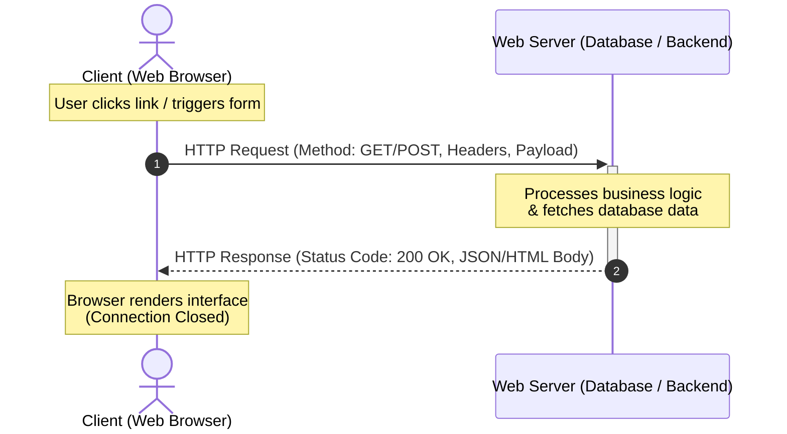

# What is HTTP?

*Original Author: Jeremy Alva | Jun 25, 2020*

Hypertext Transfer Protocol (HTTP) is the foundational standard that dictates how electronic devices communicate and exchange data across the internet. 

---

## 🏗️ The Client-Server Model & Request-Response Cycle

The communication between web applications relies on the **Client-Server Model**, where participants operate in a continuous loop called the **Request-Response Cycle**:

### The Key Participants
*   **The Client**: The frontend interface or browser (e.g., Chrome, Safari, or custom REST clients) requesting resources or sending data.
*   **The Server**: The backend hosting service or hardware running 24/7, intercepting requests and returning structured payloads.

---

## 🛠️ HTTP Request Methods (Verbs)

Clients tell the server what type of action they want to perform by using standardized **HTTP Request Methods** (also known as HTTP verbs):

| Method | Purpose | Use Case |
| :--- | :--- | :--- |
| 🟢 **GET** | Retrieve data from the server. | Loading a web page or viewing a product listing. |
| 🔵 **POST** | Send new data to the server to create a resource. | Submitting a registration form or placing an order. |
| 🟡 **PUT** | Replace/update an existing resource entirely. | Updating a user's full shipping profile details. |
| 🔴 **DELETE** | Remove a resource from the server. | Deleting a blog post or canceling a subscription. |
| ⚪ **HEAD** | Retrieve only the response headers (no body). | Checking if a file exists or checking the content length. |
| ⚪ **CONNECT** | Establish a secure tunnel to the server. | Establishing SSL connections through proxy servers. |

---

## ⚙️ Core Architectural Features of HTTP

HTTP has three underlying characteristics that influence how scalable web applications must be engineered:

### 1. Connectionless
The client and server only "know" each other during the execution of a single request and response. After the cycle completes, they disconnect. Further requests require establishing a new network connection.

### 2. Media Independent
Any type of data (text, images, audio, video, binary streams, or JSON payloads) can be transferred over HTTP, provided that both the client and the server understand the data format (specified using headers like `Content-Type`).

### 3. Stateless
The client and server are only aware of each other during the active request-response cycle. Once the response is sent, the server "forgets" the client's state. To maintain user sessions (like keeping a user logged in or holding items in a shopping cart), developers use cookies, headers, session tokens, or JWTs.
