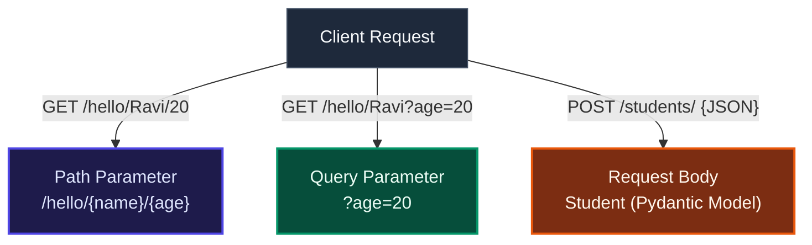

# Introduction to FastAPI & Environment Setup

FastAPI is a modern, high-performance web framework for building APIs with Python. It is designed to be developer-friendly, fast to write, and ready for production serving.

---

## ⚡ 1. Key Advantages of FastAPI

*   **Speed**: It is one of the fastest Python frameworks available. Running on top of **Starlette** (for web handling) and **Pydantic** (for data validation), its raw performance is on par with NodeJS and Go.
*   **Fast Development & Fewer Bugs**: It leverages Python's native type hinting to speed up development and significantly reduce human-induced coding errors (up to 40% reduction in developer bugs).
*   **Standards-Based**: It is fully compatible with open standards, including **OpenAPI** (formerly Swagger) and **JSON Schema**.

### Installation
To install FastAPI along with its core dependencies, run Python's package manager:

```bash
pip3 install fastapi
```

> [!NOTE]
> Installing `fastapi` automatically downloads its required underlying libraries, including Starlette (the async web microframework) and Pydantic (the data validation library).

---

## ⚙️ 2. Understanding the ASGI Server (Uvicorn)

Unlike traditional Python web frameworks (such as Flask), FastAPI does not come with a built-in development server. To run a FastAPI application, you need an **ASGI** (Asynchronous Server Gateway Interface) server.

### Why Uvicorn?
*   **Asynchronous Handling**: Older WSGI servers (like Gunicorn or uWSGI) are synchronous by design and cannot natively handle async (`asyncio`) workloads. ASGI servers allow FastAPI to handle high-concurrency connections efficiently.
*   **Advanced Protocols**: Uvicorn natively supports modern web protocols, including WebSockets and HTTP/2.

### Installation & Launching
You can install Uvicorn with standard, cython-based speed boosts and development tools (like watchfiles for hot-reloading) using the `[standard]` flag:

```bash
pip3 install "uvicorn[standard]"
```

---

## 🚀 3. Creating Your First "Hello World" App

Building a basic endpoint involves initializing the application object and binding an async handler function to a specific path using a route decorator.

### Code Example (`main.py`)
```python
from fastapi import FastAPI

# Step 1: Initialize the FastAPI application object
app = FastAPI()

# Step 2: Define a path operation decorator and a view function
@app.get("/")
async def index():
    return {"message": "Hello World"}
```

### Key Terms Explained

| Term | Explanation |
| :--- | :--- |
| **Application Object (`app`)** | The primary interaction point between your application and the client web server. The Uvicorn server listens for requests and routes them through this instance. |
| **Path / Route** | The trailing portion of the URL after the domain name. For example, in `http://localhost:8000/hello`, the path is `/hello`. |
| **Operation** | The HTTP request method/verb used by the client (e.g., `GET`, `POST`, `PUT`, `DELETE`). |
| **Path Operation Decorator** | The decorator line directly preceding the view function (like `@app.get("/")`) mapping both the path and the HTTP method to the code. |
| **Path Operation Function** | The Python function (e.g., `index()`) that executes and returns a response (which is automatically serialized into JSON) when a client visits the mapped route. |
| **`async` Keyword** | Informs FastAPI that the function can run asynchronously without blocking the underlying execution threads. *(Note: You can write standard synchronous functions without the `async` prefix if preferred).* |

### Starting the Server

#### A. Via the Command Line
```bash
uvicorn main:app --reload
```
*   `main`: Refers to your Python script name (`main.py`).
*   `app`: Refers to the variable holding your `FastAPI()` instance.
*   `--reload`: Enables automatic code reloading. The server will restart itself whenever it detects code modifications.

#### B. Programmatically (Inside the Script)
Alternatively, you can run the server directly inside your script:
```python
import uvicorn
from fastapi import FastAPI

app = FastAPI()

@app.get("/")
async def index():
    return {"message": "Hello World"}

if __name__ == "__main__":
    uvicorn.run("main:app", host="127.0.0.1", port=8000, reload=True)
```

---

## 📖 4. Automatic Documentation (OpenAPI & ReDoc)

One of FastAPI's most powerful native features is automatic schema generation. It reads your code and types, instantly providing two standard interactive API documentation interfaces:

1.  **Swagger UI** (`http://127.0.0.1:8000/docs`): An interactive portal where you can inspect available routes, review expected parameters, and execute live API requests directly from the browser using the **"Try it out"** feature.
2.  **ReDoc** (`http://127.0.0.1:8000/redoc`): A clean, professional, three-panel alternative design for viewing API specifications.

> [!TIP]
> Under the hood, FastAPI generates a complete, standardized API schema following the OpenAPI specification. This raw JSON schema is accessible directly at `http://127.0.0.1:8000/openapi.json`.

---

## 🛡️ 5. Python Type Hints & Pydantic Validation

FastAPI leverages standard Python **Type Hints** (introduced in Python 3.5+) to enforce robust runtime data validation, parsing, and type coercion.

### Type Hints Recap
Vanilla Python is dynamically typed. Type annotations (e.g., `variable: type`) inform linters, IDEs, and frameworks of the expected data categories:
*   **Basic Types**: Primitives like `int`, `float`, `str`, and `bool`.
*   **Complex Collections**: Structured collections imported from the built-in `typing` library, such as `List`, `Dict`, and `Tuple` (e.g., `subjects: List[str]`).

### Integrating Pydantic
Pydantic is the validation engine under the hood. You define data structures by creating schemas that inherit from Pydantic's `BaseModel`.

```python
from typing import List
from pydantic import BaseModel, Field

class Student(BaseModel):
    id: int
    name: str = Field(None, title="Name of student", max_length=10)
    subjects: List[str] = []
```

*   **Data Coercion**: Pydantic is smart enough to handle safe conversions. If a client submits a string `"123"` to an `int` field, Pydantic automatically converts (coerces) it into the actual integer `123`.
*   **Validation Failure**: If a value cannot be safely coerced (e.g., passing alphabetic characters to an `int` field), Pydantic blocks the request and returns a detailed `ValidationError` response with `422 Unprocessable Entity` status.
*   **Advanced Restrictions**: Using Pydantic's `Field` class allows you to append custom metadata or enforce structural constraints (e.g., `max_length=10`).

---

## 🔗 6. Parameters: Path vs. Query vs. Request Body

When receiving parameters from a client, FastAPI distinguishes them based on how they are defined in your route path and signature:



### A. Path Parameters
These are dynamic variables embedded directly inside the URL path string, defined using curly brackets `{}` in the route decorator:

```python
@app.get("/hello/{name}/{age}")
async def hello(name: str, age: int):
    return {"name": name, "age": age}
```
*   **Example URL**: `http://localhost:8000/hello/Ravi/20`
*   **Validation**: If a user attempts to request `/hello/20/Ravi`, FastAPI returns a validation error because `"Ravi"` cannot be parsed into an `age: int`.

### B. Query Parameters
When you add function parameters that are *not* defined in the literal URL decorator path, FastAPI automatically reads them as a query string (key-value pairs trailing after the `?` character):

```python
@app.get("/hello/{name}")
async def hello(name: str, age: int):
    return {"name": name, "age": age}
```
*   **Example URL**: `http://localhost:8000/hello/Ravi?age=20`
*   *Here, `name` is parsed from the path, and `age` is extracted from the query parameters.*

### C. Request Body (POST Requests)
To accept complex, nested, or bulk data structures, send them inside the HTTP request body. You declare this in FastAPI simply by using your Pydantic schema as a parameter type hint:

```python
@app.post("/students/")
async def student_data(s1: Student):
    return s1
```
*   FastAPI intercepts the payload, parses the JSON body to verify compatibility with the `Student` model, and instantiates the Pydantic object to be used inside your function.

---

## 🛠️ 7. Parameter Validation Using Operators

You can enforce numeric and string constraints directly on path and query parameters by importing `Path` and `Query` from `fastapi`.

### Numeric Validation Comparison Operators
Use these short conditional abbreviations to restrict parameter bounds:
*   `gt`: Greater than
*   `ge`: Greater than or equal to
*   `lt`: Less than
*   `le`: Less than or equal to

### Code Combining Path, Query, and Request Body Restrictions
```python
from fastapi import FastAPI, Path, Query, Body

app = FastAPI()

@app.get("/hello/{name}/{age}")
async def hello(
    *, 
    name: str = Path(..., min_length=3, max_length=10), # Path parameter string length validation
    age: int = Path(..., ge=1, le=100),                # Path parameter numeric boundaries
    percent: float = Query(..., ge=0, le=100)          # Query parameter numeric boundaries
):
    return {"name": name, "age": age, "percent": percent}
```

> [!IMPORTANT]
> The ellipsis (`...`) used inside the validator (e.g. `Path(...)` or `Query(...)`) indicates that the parameter is **required** and cannot be omitted by the client. The prepended asterisk (`*`) in the function arguments tells Python that all subsequent arguments must be passed as keyword arguments.

---

## ⏳ 8. Background Tasks (Asynchronous Processing)

Machine learning model inference (especially Large Language Models, high-dimensional embeddings, or image generation pipelines) can take several seconds to minutes to compute. Blocking a standard HTTP connection while waiting for inference to finish can lead to gateway timeouts (e.g., `504 Gateway Timeout`) and exhaust your server's connection pool.

### How it Works
Instead of making the client wait, FastAPI allows you to return an immediate `200 OK` response containing a confirmation or a "Task ID", while delegating the heavy machine learning computation to FastAPI's built-in `BackgroundTasks` engine to run out-of-band.

```python
from fastapi import FastAPI, BackgroundTasks

app = FastAPI()

def run_ai_inference(prompt: str):
    # Heavy LLM initialization and token generation runs here
    # Results can be persisted directly to a database
    pass

@app.post("/generate")
async def generate_text(prompt: str, background_tasks: BackgroundTasks):
    # Delegate the heavy task to the background executor
    background_tasks.add_task(run_ai_inference, prompt)
    
    # Return an immediate response to keep the web layer free
    return {
        "status": "Processing initiated", 
        "message": "The AI model is processing your prompt. Results will be saved to the database."
    }
```

> [!NOTE]
> **Production Scaling Tip**: FastAPI's built-in `BackgroundTasks` runs inside the same process using an async event loop or a thread pool. For high-scale enterprise environments, you should transition this pattern to dedicated distributed task queues like **Celery** or **Dramatiq** backed by **Redis** or **RabbitMQ**. This keeps your web nodes completely lightweight.

---

## 🧠 9. Advanced Dependency Injection: Lifespan Events

In an AI application, loading deep learning weights (such as a 7B parameter LLM, a PyTorch model, or a Hugging Face pipeline) into memory (RAM/VRAM) is extremely resource-intensive. **You absolutely cannot load the model weights inside your endpoint router function on every incoming request.**

### The Lifespan Context Manager
FastAPI provides a modern `lifespan` hook. This context manager allows you to:
1. Load your machine learning models **once** during server startup.
2. Store them globally in memory so they are shared across all requests.
3. Clean up memory and release GPU VRAM when the server shuts down.

```python
from contextlib import asynccontextmanager
from fastapi import FastAPI

# Global dictionary to hold model references in memory
ml_models = {}

def fake_load_heavy_model_weights():
    # Simulate loading model weights into VRAM
    return "Loaded PyTorch Model Weights"

@asynccontextmanager
async def lifespan(app: FastAPI):
    # --- Startup phase ---
    # Load the heavy ML model weights when the server boots up
    ml_models["llm_model"] = fake_load_heavy_model_weights()
    yield
    # --- Shutdown phase ---
    # Clean up resources and release VRAM when the server stops
    ml_models.clear()

# Initialize FastAPI with the lifespan context manager
app = FastAPI(lifespan=lifespan)
```

---

## 🌊 10. Streaming Responses (For LLMs)

When building conversational AI interfaces (similar to ChatGPT), waiting for a long sequence (e.g., a 500-word response) to generate completely before returning a response creates significant latency and a poor user experience.

### The StreamingResponse Abstraction
By combining Python generators (`yield`) with FastAPI's `StreamingResponse`, you can stream individual output tokens chunk-by-chunk to the frontend in real-time using standard **Server-Sent Events (SSE)**.

```python
import asyncio
from fastapi import FastAPI
from fastapi.responses import StreamingResponse

app = FastAPI()

async def token_generator():
    tokens = ["AI ", "applications ", "require ", "real-time ", "streaming ", "responses! "]
    for token in tokens:
        yield token
        await asyncio.sleep(0.2)  # Simulating GPU/model token-generation latency

@app.get("/stream-chat")
async def stream_chat():
    # Return a stream using the standard SSE content type
    return StreamingResponse(token_generator(), media_type="text/event-stream")
```

---

## 🛡️ 11. Middlewares & Rate Limiting

Serving deep learning models on GPUs is highly expensive. To protect your underlying infrastructure from malicious clients, scraping bots, or accidental resource starvation, you must implement defensive layers.

### 🚪 Rate Limiting
Implementing rate-limiting middlewares helps track incoming client requests by their IP address or API token. If a client exceeds a configured threshold (e.g., 5 requests per minute), FastAPI intercepts the request early and returns an `HTTP 429 Too Many Requests` error before the workload hits your GPU pipeline.

### 🌐 Cross-Origin Resource Sharing (CORS) Middleware
CORS middleware is critical when your frontend client application (e.g., React, Vue, Next.js) is hosted on a different domain than your backend FastAPI service. It governs which origins are allowed to make cross-site HTTP requests.

```python
from fastapi import FastAPI
from fastapi.middleware.cors import CORSMiddleware

app = FastAPI()

# Configure origins allowed to access the API
origins = [
    "http://localhost:3000",
    "https://my-ai-app.com",
]

app.add_middleware(
    CORSMiddleware,
    allow_origins=origins,
    allow_credentials=True,
    allow_methods=["*"],
    allow_headers=["*"],
)
```

---

## 🚨 12. Structured Error Handling & Global Exceptions

When an AI application experiences a runtime failure (such as a vector database timeout, database disconnect, or a shape mismatch during token embedding), returning a raw Python stack trace to the client is a security risk and results in an unprofessional user experience.

### Custom Exception Handlers
You can register global exception handlers that intercept specific backend exceptions, capture the error metadata, log it internally, and format a clean, standardized JSON error response for the client app.

```python
from fastapi import FastAPI, Request, status
from fastapi.responses import JSONResponse

app = FastAPI()

# Custom exception class
class VectorDBConnectionError(Exception):
    def __init__(self, name: str):
        self.name = name

# Global exception handler registration
@app.exception_handler(VectorDBConnectionError)
async def vector_db_exception_handler(request: Request, exc: VectorDBConnectionError):
    return JSONResponse(
        status_code=status.HTTP_503_SERVICE_UNAVAILABLE,
        content={
            "error": "VectorDatabaseUnavailable",
            "message": f"Could not establish connection to Vector Database: {exc.name}. Please retry shortly.",
        },
    )
```

---

## 📊 13. Summary: The Production-Grade AI Stack

To understand how these components interlock in a production architecture, consider this high-scale request pipeline:

```mermaid
graph TD
    Client[Client Request] -->|1. Hits Middleware| RateLimit[Rate Limiter Middleware<br/>Checks IP / Token]
    RateLimit -->|Valid| CORS[CORS Middleware<br/>Validates Domain Cross-Origin]
    CORS -->|Approved| Router[FastAPI Router<br/>Reads global Lifespan models]
    
    subgraph FastAPI Lifespan (Pre-loaded VRAM)
        ModelWeights[ML Model Weights loaded once at startup]
    end
    
    Router -->|Option A: Short Task| Predict[Immediate Inference<br/>Returns JSON response]
    Router -->|Option B: Heavy Background Task| BgTask[BackgroundTasks.add_task<br/>Returns 200 OK + JobID immediately]
    Router -->|Option C: LLM / Chat Generation| Stream[StreamingResponse<br/>Yields chunk-by-chunk tokens via SSE]
    
    Predict -.-> ErrorHandler[Global Exception Handler<br/>Catches DB / VRAM mismatch, returns clean JSON]
    BgTask -.-> ErrorHandler
    Stream -.-> ErrorHandler
    
    classDef default fill:#1e293b,stroke:#475569,stroke-width:1px,color:#f8fafc;
    classDef client fill:#1e1b4b,stroke:#4f46e5,stroke-width:2px,color:#e0e7ff;
    classDef middleware fill:#7c2d12,stroke:#ea580c,stroke-width:2px,color:#fff7ed;
    classDef lifespan fill:#1e293b,stroke:#a855f7,stroke-width:2px,color:#f3e8ff;
    
    class Client client;
    class RateLimit,CORS middleware;
    class ModelWeights lifespan;
```

By leveraging **Lifespan Context Managers** to handle large weights in memory, using **Background Tasks** and **Streaming Responses** to manage processing latencies, and securing the pipeline using **CORS** and **Rate Limiting** middlewares, you shift your FastAPI architecture from a simple prototype into an enterprise-ready machine learning platform.
