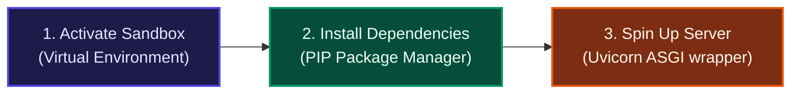

# Python Web Development Essentials: Virtual Environments, PIP, and Uvicorn

Developing and serving a modern Python web application—such as a FastAPI backend for your Machine Learning models—requires a specific set of foundational tools to manage scope, handle third-party libraries, and serve traffic.

These three concepts work in a precise sequence:
1. **Activate** your isolated sandbox (Virtual Environment).
2. **Install** your dependencies cleanly (PIP).
3. **Spin up** your ASGI web server (Uvicorn) so the outside world can access your application.



---

## 🛡️ 1. Virtual Environment (Entering the Sandbox)

Before running or installing any packages, you must create and activate an isolated **Virtual Environment** (such as `venv` or `conda`).

*   **The Concept**: Think of a virtual environment as a secure, private cleanroom or sandbox. By default, your operating system has a single "global" Python setup. If you install packages globally, different projects will inevitably overwrite each other's files, resulting in dependency conflicts and broken installations.
*   **What Activation Does**: Activating an environment updates your shell's temporary environment paths (`PATH`). It instructs your terminal: *"For the rest of this session, any Python execution, package import, or package installation must run within and modify this specific project directory."*

### How to Activate an Environment
Navigate to your project directory in the terminal and run the appropriate script:

#### Windows (PowerShell / Command Prompt)
```powershell
.venv\Scripts\activate
```
*(You will see `(.venv)` prepend your terminal command prompt, indicating activation).*

#### macOS / Linux
```bash
source .venv/bin/activate
```

---

## 📦 2. PIP (The Package Delivery Driver)

**PIP** stands for **Pip Installs Packages**. It is the official, built-in package manager for the Python ecosystem.

*   **The Concept**: Think of PIP as a secure App Store or Amazon Delivery service specifically for code. Instead of manually searching the web, downloading `.zip` archives, extracting libraries, and dragging folders into your project, PIP automates the entire lifecycle.
*   **How it Works**: When you execute an install command, PIP connects to a secure global cloud repository called **PyPI** (the Python Package Index). It downloads the requested package, resolves its dependencies, and installs them into your currently active virtual environment.

### Common PIP Commands
```bash
# Install a specific library
pip install fastapi

# Install a defined list of project dependencies at once
pip install -r requirements.txt
```

---

## ⚡ 3. Uvicorn (The Server Wrapper)

Once your virtual environment is active and your frameworks (like FastAPI and Pydantic) are installed via PIP, you need a way to serve your code over the network. That is the role of **Uvicorn**.

*   **The Concept**: Uvicorn is a lightning-fast **ASGI (Asynchronous Server Gateway Interface)** web server. It acts as the wrapper/engine that listens for incoming web requests from the outside world (like client browsers, web apps, or mobile frontends) and routes them into your Python application.
*   **Why It is Essential**: Plain Python scripts cannot natively bind to network ports (like port `8000`) or listen for raw HTTP streams out-of-the-box. Uvicorn sits on your host machine, intercepts incoming HTTP packets, translates them into the standardized ASGI format for FastAPI, catches your Python app's output, and flashes the HTTP response back to the client.

### Launching the Server
Start Uvicorn from your active terminal to spin up your backend API:
```bash
uvicorn main:app --reload
```
> [!TIP]
> The `main:app` parameter instructs Uvicorn to look inside the `main.py` file, find the `app` instance (your FastAPI application object), and bind to it. The `--reload` flag enables hot-reloading: the server will automatically restart whenever you modify your Python code.

---

## 📊 Summary of the Development Workflow

When starting a development session on your application, you will execute these concepts in a strict linear order:

| Step | Component | Action | Real-World Analogy |
| :---: | :--- | :--- | :--- |
| **1** | **Activate Environment** | Run the activation script in your terminal workspace. | **Stepping into a secure, private workshop.** |
| **2** | **PIP** | Install dependencies (e.g., `pip install fastapi uvicorn`). | **Ordering specialized tools and materials into that workshop.** |
| **3** | **Uvicorn** | Launch the ASGI server (e.g., `uvicorn main:app --reload`). | **Opening the front doors of your workshop so customers can buy your product.** |
