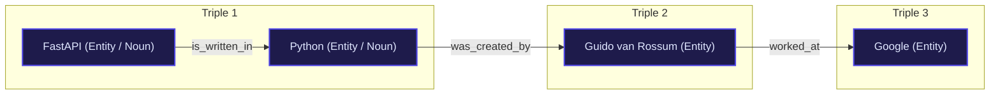

# Introduction to GraphRAG & Knowledge Graphs

Retrieval-Augmented Generation (RAG) has transformed how we ground Large Language Models (LLMs) in proprietary data. However, as dataset scales grow and query complexities evolve, traditional vector-similarity RAG systems reveal major structural limitations. 

**GraphRAG**—pioneered by Microsoft Research—represents a next-generation retrieval paradigm that integrates **Knowledge Graphs** with vector search to enable deep reasoning, multi-hop connection extraction, and global document summarization.

---

## 🌐 1. What is a Knowledge Graph?

A **Knowledge Graph (KG)** is a structured programmatic network that represents real-world entities—such as people, places, organizations, objects, or abstract concepts—and explicitly defines the semantic relationships between them.

Instead of storing data in isolated, flat rows and columns like a relational database, a knowledge graph organizes information exactly how humans think: as an interconnected web of facts.

### 📐 The Core Anatomy: Triples (Nodes and Edges)
At the micro-level, every knowledge graph is built using a semantic framework called a **triple**. A triple breaks down any real-world fact into a basic three-part sentence structure: **Subject ➔ Predicate ➔ Object**.

*   **Nodes (Entities / Subject & Object)**: These represent the "nouns" in your system. For example, `FastAPI` (a technology) and `Python` (a language).
*   **Edges (Relations / Predicate)**: These represent the "verbs" or properties that connect the nouns. For example, `is_written_in`.

When you chain thousands of these triples together, they form a vast, interconnected network graph:

---

## ⚙️ 2. How Knowledge Graphs Work Under the Hood

To make graph data programmatically indexable and searchable by machine learning systems, knowledge graphs rely on three core architectural layers:

### A. Ontologies and Schemas
An **ontology** is a formal set of rules or a "blueprint" that defines the categories of things allowed in the graph. It dictates what types of entities can exist and how they are permitted to interact. 

> [!NOTE]
> For example, the ontology might state: *"An entity of type `Software` can have a relation `is_written_in` pointing to an entity of type `Language`, but it cannot have a relation `is_married_to`."*

### B. Graph Databases (NoSQL)
Instead of standard SQL tables, knowledge graphs are typically hosted in specialized **Graph Databases** (such as Neo4j, Amazon Neptune, or GraphDB). These databases are optimized to traverse relationships instantly. 

In a standard relational database, finding connections requires expensive multi-table `JOIN` operations; in a graph database, the engine simply "walks" along pre-existing physical pointers (edges) from node to node in memory.

### C. W3C Semantic Web Standards
Many enterprise knowledge graphs utilize standardized global frameworks to ensure open compatibility across systems:
*   **URI (Uniform Resource Identifier)**: Every single node has a unique URI web address to prevent naming confusion (e.g., distinguishing between Apple the company and apple the fruit).
*   **RDF (Resource Description Framework)**: The standard layout format used to express data triples.
*   **SPARQL**: The specialized query language used to extract answers from graph databases (similar to how SQL is used for tabular datasets).

---

## 📊 3. Knowledge Graphs vs. Traditional Databases

| Feature | Relational Database (SQL / RDBMS) | Knowledge Graph (Graph Database) |
| :--- | :--- | :--- |
| **Data Layout** | Rigid tables, rows, and columns. | Flexible network of interconnected nodes and properties. |
| **Handling Relationships** | Requires complex, slow foreign-key `JOIN` tables. | Relationships are treated as first-class data elements (**Edges**). |
| **Schema Flexibility** | Rigid. Adding a new column requires altering the database schema and locking tables. | Fluid. You can inject new entity or relationship types instantly without breaking existing data. |
| **Intelligence Level** | Stores raw, flat data values. | Understands semantic context and can infer hidden facts using reasoners. |

---

## 💼 4. Real-World Applications

*   **Google's Knowledge Graph**: When you search for a landmark or public figure, a "Knowledge Panel" appears on the right side of the screen displaying facts, dates, and related entities. This is populated instantly from a graph database containing billions of interconnected facts.
*   **Recommendation Engines**: E-commerce platforms like Amazon map your interactions to a graph. If `User A ➔ bought ➔ Item X`, and `Item X ➔ is_compatible_with ➔ Item Y`, the graph dynamically infers that `User A` might want to buy `Item Y`.
*   **Enterprise Data Fabrics**: Large corporations map mismatched data silos (financial spreadsheets, HR portals, inventory logs) into a single cohesive semantic knowledge graph to eliminate data fragmentation.

---

## 🧠 5. What is GraphRAG & Why is it Used?

To understand why **GraphRAG** is a major breakthrough in AI engineering, we must analyze where traditional RAG fundamentally breaks down and how integrating a Knowledge Graph resolves those limitations.

### Traditional RAG Recap
1. Your raw text documents are chopped up into small, independent blocks called **chunks**.
2. Chunks are converted into mathematical vectors (**embeddings**) and stored in a **Vector Database**.
3. When a user asks a question, the system searches for chunks with high cosine similarity to the query embedding.
4. It pulls the top $N$ chunks and hands them to the LLM to write an answer.

```mermaid
graph TD
    %% Traditional RAG
    subgraph "Traditional RAG (Vector-Similarity)"
        Q1[User Query] -->|1. Vector Scan| DB[(Vector Database)]
        DB -->|2. Similarity Fetch| Chunks[Isolated Text Chunks<br/>Chunk 1, Chunk 400]
        Chunks -->|3. Flattened Context| LLM1[LLM Reasoning]
    end

    %% GraphRAG
    subgraph "GraphRAG (Entity-Relationship)"
        Q2[User Query] -->|1. Vector Search + Community Walk| KG[(Knowledge Graph Database)]
        KG -->|2. Multi-hop Traversal| Graph["Semantic Mind-map<br/>Sebastian ➔ created ➔ FastAPI ➔ Python"]
        Graph -->|3. Structured Truth Context| LLM2[LLM Reasoning]
    end
    
    classDef default fill:#1e293b,stroke:#475569,stroke-width:1px,color:#f8fafc;
    classDef target fill:#1e1b4b,stroke:#4f46e5,stroke-width:2px,color:#e0e7ff;
    classDef graphDb fill:#064e3b,stroke:#059669,stroke-width:2px,color:#ecfdf5;
    
    class Chunks,Graph target;
    class DB,KG graphDb;
```

---

## 🚨 6. The Big Flaws of Traditional RAG

While standard RAG is excellent for finding specific, localized facts (e.g., *"What was the revenue listed on page 4?"*), it suffers from three massive architectural blind spots:

### A. The "Connecting the Dots" Failure (Multi-Hop Reasoning)
Standard RAG treats text chunks as isolated islands. It does not understand how a person mentioned in *Chunk 1* relates to a technology mentioned in *Chunk 400*. If your question requires jumping across multiple pieces of disconnected information to formulate an answer, standard RAG will fail to retrieve the correct context.

### B. The Global Summary Blind Spot
If you ask standard RAG: *"What are the top three overarching themes across this entire 500-page dataset?"*, it will fail. Because no single text chunk contains the high-level summary, standard vector search will pull random, disconnected paragraphs, leaving the LLM with an incomplete picture.

### C. Semantic Mismatch (Clueless Context)
Vector search relies on linguistic similarity. If two concepts are deeply related but described using completely different vocabulary across different documents, a standard vector database will miss the connection entirely.

---

## 🚀 7. Enter GraphRAG: The Ingestion & Retrieval Paradigm

GraphRAG solves these issues by combining a **Vector Database** with a **Knowledge Graph** before passing context to the LLM. 

During the ingestion phase, GraphRAG utilizes an LLM to read your text corpus, identify real-world **Entities** (people, concepts, technologies) and **Relationships** (how they connect), and map them into a structured network in your graph database:
*   **Nodes**: The entities (e.g., `FastAPI`, `Pydantic`, `Python`).
*   **Edges**: The explicit relationship connections (e.g., `FastAPI ➔ uses ➔ Pydantic`).
*   **Claims / Covariates**: Factual statements bound directly to the edges.

### GraphRAG's Core Superpowers

#### 🛰️ Superpower 1: True Multi-Hop Reasoning
Because the data is explicitly linked by edges, the retrieval engine can "walk" the graph.
*   **Example Query**: *"Which programming languages are used by developers at companies that Sebastian Ramirez has worked for?"*
*   **Standard RAG** would have to randomly find chunks mentioning Sebastian, his companies, and their tech stacks. 
*   **GraphRAG** simply locates the `Sebastian Ramirez` node and follows its edges: `Sebastian Ramirez ➔ created ➔ FastAPI ➔ written_in ➔ Python`.

#### 🏛️ Superpower 2: Hierarchical Community Summarization
GraphRAG groups tightly interconnected nodes into clusters called **communities** (e.g., grouping all nodes related to "FastAPI deployment" together). It then pre-summarizes these communities using the LLM. When you ask a global question like *"Summarize the tech stack flaws described in these logs"*, GraphRAG retrieves the high-level pre-computed community summaries rather than thousands of raw, unsummarized text chunks.

#### 🛡️ Superpower 3: Complete Elimination of Hallucinations
Because relationships are structured explicitly as deterministic graph data (Subject ➔ Predicate ➔ Object), the LLM is tightly constrained by absolute, verifiable structural truths. This prevents the model from speculating or guessing how facts are linked together.

---

## 🎯 Summary: When to Use Which?

| Feature | Traditional RAG | GraphRAG |
| :--- | :--- | :--- |
| **Underlying Storage** | Flat text chunks + Vector embeddings. | Structured Knowledge Graph + Vector embeddings. |
| **Best Query Type** | **Specific & Localized**: *"What was the total profit in Q3?"* | **Global & Analytical**: *"What are the systemic risks across our portfolio?"* |
| **Reasoning Ability** | **Low**: Cannot connect data points hidden across different documents. | **High**: Seamlessly loops through multiple relational "hops." |
| **Ingestion Cost** | Cheap and very fast. | Expensive and slower (requires LLMs to parse and build the graph upfront). |

> [!TIP]
> Think of **Traditional RAG** as a search engine that searches for specific paragraphs in a library. Think of **GraphRAG** as a search engine that builds a massive, conceptual **mind-map** of the entire library first, allowing it to explain the complex web of relationships across every single book.
