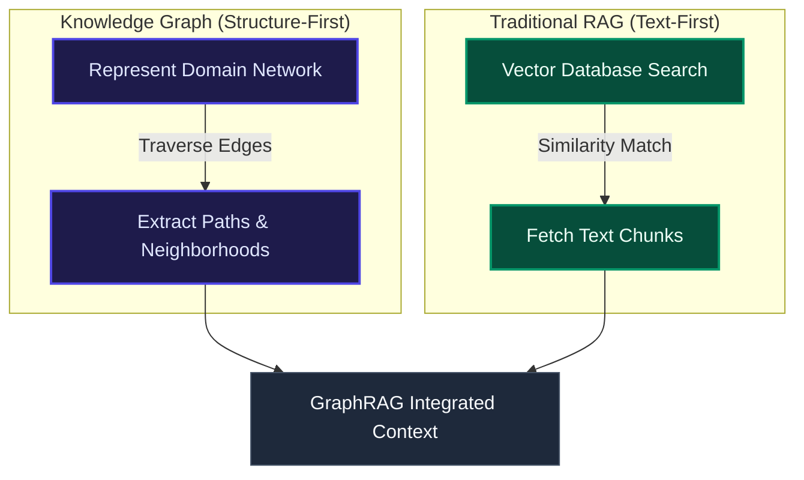

# Knowledge Graph vs. RAG: Know the Differences

*Original Author: Jaz Ku | January 2, 2026*

Large Language Models (LLMs) can produce highly fluent answers that are still factually wrong. This largely comes down to how they are trained: they learn patterns from large, static corpora that quickly lose relevance, meaning they inherit whatever those datasets include—and whatever they miss. At inference time, they do not look up your latest truth by default; they predict the next most likely token given the prompt. When there are gaps, the model often fills them with plausible-sounding text, resulting in hallucinations.

This reliability problem is exactly what **Retrieval-Augmented Generation (RAG)** aims to address. RAG supplies external context to an LLM at generation time, retrieving relevant sources and including them in the prompt so outputs are anchored to evidence. 

While traditional RAG systems use semantic search over documents in a vector database, **GraphRAG** builds on that foundation by adding a **Knowledge Graph** layer to recover relational context and reduce noise when the question depends on how entities connect.

---

## ⚖️ Knowledge Graph vs. RAG: At a Glance

---

## 🕸️ What is a Knowledge Graph?

A **Knowledge Graph (KG)** represents what your organization knows as a network of connected facts. It is composed of three core building blocks:

*   **Nodes**: Represent entities like users, devices, services, and orders.
*   **Edges**: Represent relationships between entities, such as `PURCHASED`, `DEPENDS_ON`, or `OWNS`.
*   **Properties**: Store attributes as key-value pairs (e.g., `risk_score`, `created_at`, or `status`). Both nodes and edges can carry properties.

### The Power of Relational Context
This mix of relationships plus attributes is what adds deep context. You can ask complex structural queries that go beyond simple semantic lookups:
*   *"Which customers are two hops away from a churn signal?"*
*   *"Which public-facing service can reach a sensitive database through misconfigured permissions?"*

Because relationships are first-class citizens in a graph database, queries can traverse many hops and return paths, neighborhoods, and dependency chains. Doing this with traditional tables requires repeated, computationally expensive SQL `JOIN` operations.

Knowledge graphs are highly flexible. As your domain data changes, you can introduce new entity types, new relationships, or new properties without redesigning your entire database model.

> [!TIP]
> **Data Ingestion for Graphs**: Knowledge graphs are constructed by mapping existing identifiers and relationships from structured sources (relational tables, event logs, APIs) into a graph model. They can also incorporate unstructured sources (documents, support tickets) by extracting entities and relationships using Natural Language Processing (NLP) or LLMs.

---

## 🔍 What is Retrieval-Augmented Generation (RAG)?

**Retrieval-Augmented Generation (RAG)** is an architectural pattern for grounding LLM outputs in external, up-to-date sources. Instead of retraining a model every time your data changes, you retrieve the most relevant context at query time and pass it into the prompt. 

This approach is faster to iterate on, cheaper to operate, and easier to keep current than fine-tuning or full model retraining.

### The Traditional RAG Workflow
Traditional RAG operates in two primary stages:

1.  **Retrieval**: The user's query is converted into a vector embedding and compared against document chunk embeddings in a vector database. Using Approximate Nearest Neighbor (ANN) search, the system pulls back the $k$ most similar chunks.
2.  **Generation**: The retrieved chunks are concatenated into the prompt, and the LLM answers using this enriched context.

### Key Limitations of Traditional RAG
*   **Similarity Is Not Relevance**: Embedding similarity can return text matching the query's wording while missing the user's actual semantic intent.
*   **Isolated Vectors**: Vectors excel at locating nearby text but do not encode the relationships that connect entities across documents.
*   **Context Window Noise**: Traditional RAG often dumps large, raw passages into the prompt. This adds noise and can push important details out of the LLM's limited context window.

---

## 🔗 Knowledge Graph RAG (GraphRAG)

**Knowledge Graph RAG (GraphRAG)** adds a graph layer to the RAG pipeline. This ensures retrieval captures both similar text and the relationships connecting the data behind that text. This is useful when queries require joining context across systems, following dependencies, or reasoning over multi-hop chains, shifting the focus from *"Which document mentions X?"* to *"How does X relate to Y?"*

GraphRAG is typically implemented as a **dual-channel retrieval** system:
1.  **Text Channel (Traditional RAG)**: Embeds the query and retrieves the most similar passages from a vector index.
2.  **Graph Channel (Knowledge Graph)**: Runs entity linking to map query mentions to graph nodes, then extracts relevant subgraphs, neighbor nodes, multi-hop relationships, and graph metadata.

A context merger combines the results from both channels into a single prompt. The LLM receives documentary evidence (retrieved text) plus relational structure (subgraph context), producing more grounded and accurate answers.

---

## 📊 Side-by-Side Comparison

| Dimension | Knowledge Graph | Traditional RAG |
| :--- | :--- | :--- |
| **Core Purpose** | Representation layer for domain knowledge (entities + relationships). | Delivery pattern for LLMs (retrieve context at query time and inject into the prompt). |
| **Primary Outputs** | Paths, subgraphs, neighborhoods, dependency chains, and explainable relationship traces. | Snippets/chunks of text evidence that the LLM synthesizes into an answer. |
| **Optimizes For** | **Relationships & Context**: explicit connections, multi-hop reasoning, consistent semantics. | **Fast Relevance & Grounding**: quickly finding supporting passages to reduce hallucinations. |
| **Updates** | **Incremental**: Adding/updating nodes, edges, and properties as new data arrives. | **Batch Indexing**: Re-chunking, re-embedding, and re-indexing as documents change. |
| **Query Focus** | *"How is X connected to Y?"* | *"What do the docs say about X?"* |

---

## 📅 A Brief History of Both Paradigms

### Knowledge Graphs
Knowledge graphs grew out of semantic web research in the late 1990s and 2000s, pushing standards like **RDF** for describing linked data and **SPARQL** for querying it. In 2012, Google popularized the term "Knowledge Graph" to describe how it connects search entities. 

Simultaneously, property graphs gained momentum in the late 2000s and early 2010s, with graph databases and readable query languages making it practical to model connected data in production. Today, newer tooling (like PuppyGraph) allows teams to model and query existing relational tables as a graph directly, bypassing the need to maintain a separate graph database copy.

### Retrieval-Augmented Generation (RAG)
RAG was formalized in 2020 by Facebook AI Research in the paper *"Retrieval-Augmented Generation for Knowledge-Intensive NLP Tasks"*. It proposed dividing search-heavy AI into an external retriever and a generator. 

Since then, the ecosystem has focused on making RAG production-ready through stronger retrieval, rerankers, semantic chunking, and expanding search capability to multi-modal assets (images, audio, and video).

---

## 🎯 Which is Best: Knowledge Graph or RAG?

They are not mutually exclusive; they solve different problems at different layers of the stack.

### When to Choose Knowledge Graphs
Knowledge graphs excel at organizing connected information into a unified, navigable view. Use them for:
*   **Integrating Diverse Sources**: Combining data across systems without identical schemas.
*   **Unifying Entities**: Creating shared meaning across teams.
*   **Provenance & Explainability**: Tracing facts back to their exact sources.

### When to Choose RAG
RAG is designed to improve LLM outputs by retrieving relevant, up-to-date information at query time. Use it for:
*   **Grounding Outputs**: Preventing hallucinations by anchoring responses to source context.
*   **Keeping Answers Current**: Incorporating changes without retraining cycles.
*   **Unstructured Data**: Making documents, PDFs, and emails searchable via embeddings.

> [!NOTE]
> Traditional RAG can struggle to connect the dots across related data points. In these scenarios, **GraphRAG** provides the optimal solution, adding a knowledge graph layer to scope retrieval, add relational context, and filter out noise.
