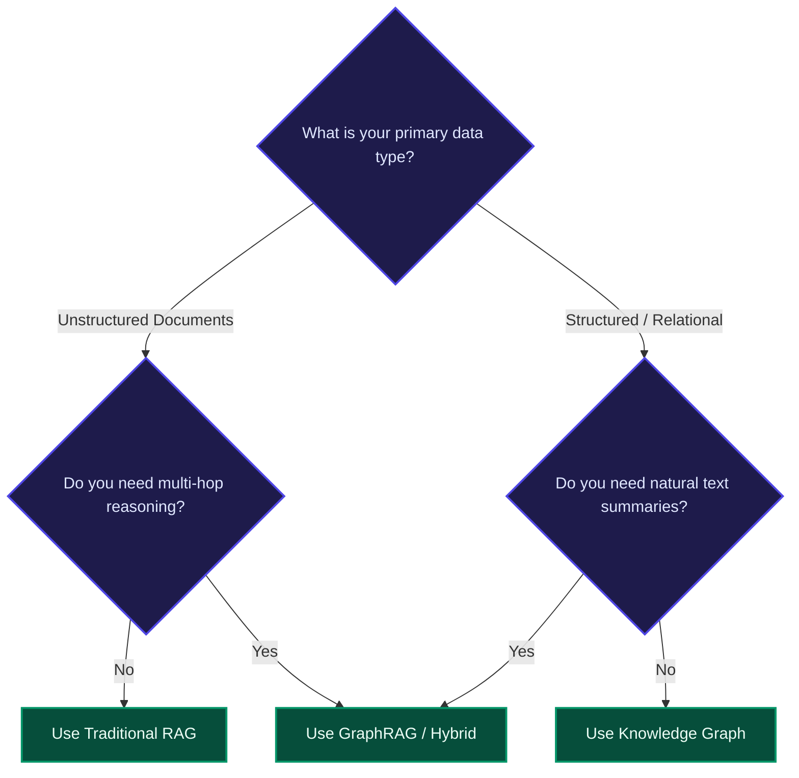
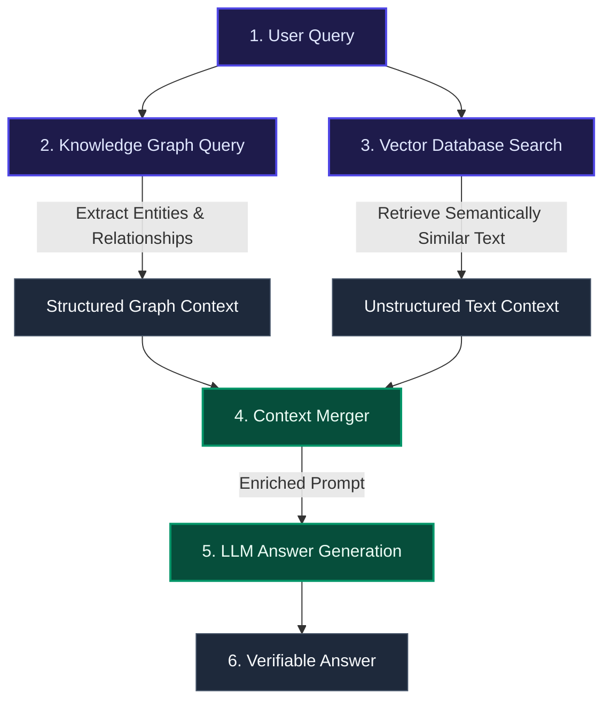

# RAG vs. Knowledge Graphs: Which Delivers Better Performance for Enterprise AI?

Enterprise AI success is no longer just about choosing the best Large Language Model (LLM). Instead, it depends on how effectively organizations retrieve, structure, and feed data to those models. Without reliable data grounding, LLMs suffer from hallucinations, inconsistency, and security risks. 

To solve this, two primary architectures have emerged: **Retrieval-Augmented Generation (RAG)** and **Knowledge Graphs**. Now, the rise of **Agentic AI** is redefining both paradigms by changing how models access and reason over knowledge at runtime.

---

## 📋 TL;DR Summary

*   **RAG** excels at speed, flexibility, and retrieving information from unstructured text (like PDFs, emails, and markdown files).
*   **Knowledge Graphs** deliver absolute accuracy, explainable reasoning paths, and strict data governance.
*   **GraphRAG (Hybrid)** combines both systems, emerging as the modern enterprise standard.
*   **Agentic AI** acts as the orchestration layer, using RAG to find facts, GraphRAG to find connections, and tools/APIs to solve complex problems dynamically.

---

## ⚡ Why Data Architecture Matters for Enterprise AI Strategy

According to industry research (such as Gartner and McKinsey), the majority of enterprise AI project failures stem from data quality and context issues, not the LLM itself. Up to $60\%$ of AI initiatives struggle due to poor data foundations. 

To bridge this gap, developers must choose the right context retrieval layer:
*   **RAG** focuses on fetching relevant document snippets at runtime and feeding them to the LLM.
*   **Knowledge Graphs** explicitly define how concepts, facts, and rules connect, allowing the LLM to reason step-by-step.

---

## 🔍 Understanding RAG Architecture

### What is RAG?
RAG (Retrieval-Augmented Generation) is an architectural pattern that improves LLM answers by searching external files for facts before letting the model write a response.

```
[User Query] ➔ [Convert to Vector] ➔ [Scan Vector DB] ➔ [Retrieve Snippets] ➔ [LLM Response]
```

### Why RAG is the Baseline Standard
*   **Handles Unstructured Data**: Easily parses PDFs, support logs, emails, and spreadsheets.
*   **Fast Implementation**: Can be set up in days using open-source vector databases.
*   **No Model Retraining**: Keeps answers fresh by updating the database index, not the model weights.

### Key Limitations of RAG
*   **No Deep Reasoning**: RAG retrieves text blocks but does not understand how a fact in *Doc A* connects to a fact in *Doc B*.
*   **Information Silos**: Information remains isolated within separate files.
*   **The "Lost-in-the-Middle" Problem**: Flooding the LLM with too many text chunks degrades performance. Research (Stanford 2023) shows that LLMs are poor at finding relevant facts when they are buried in the middle of long prompts.

---

## 🕸️ Understanding Knowledge Graphs

### What are Knowledge Graphs?
A Knowledge Graph stores information as an interconnected network of facts. 

*   **Nodes**: The entities (nouns like `User`, `Server`, or `Location`).
*   **Edges**: The relationships (verbs like `OWNS`, `DEPENDS_ON`, or `REPORTS_TO`).
*   **Ontology**: A formal schema defining the rules of what nodes and edges are allowed to connect.

### How Knowledge Graphs Get Built (The Ingestion Pipeline)
Building a graph from raw documents requires an information extraction pipeline:
1.  **Named Entity Recognition (NER)**: Identifying real-world nouns in text (people, products, companies).
2.  **Relation Extraction (RE)**: Identifying how these nouns connect (e.g., `works_at`, `acquired`).

#### Two Implementation Approaches:
*   **Custom LLM Pipelines**: Prompting an LLM to extract entities/relations based on a strict schema. This is highly accurate but requires custom code for entity resolution (e.g., recognizing that "OpenAI" and "Open AI" are the same node).
*   **Framework Tools**: Using built-in graph transformers (like LangChain or LlamaIndex) to auto-generate graphs. Excellent for quick prototypes, but offers less control over ontology design.

### Key Limitations of Knowledge Graphs
*   **High Setup Complexity**: Creating ontologies and cleaning data requires significant domain expertise.
*   **Slower Time-to-Value**: Building and deploying a comprehensive graph takes longer than indexing text for RAG.
*   **Maintenance Overhead**: Keeping the graph updated as new records arrive requires continuous database management.

---

## 📊 Core Architectural Differences

| Dimension | Retrieval-Augmented Generation (RAG) | Knowledge Graph |
| :--- | :--- | :--- |
| **Data Format** | Unstructured text documents (PDFs, markdown, logs). | Structured entities, properties, and relationships. |
| **Retrieval Method** | Probabilistic vector similarity (semantic match). | Deterministic path traversal (exact link walking). |
| **Explainability** | Low (returns similarity scores). | High (returns traceable database paths). |
| **Reasoning Ability** | Limited to single-document lookups. | Advanced (handles multi-hop connection queries). |
| **Setup Speed** | Very fast (days to weeks). | Slower (weeks to months). |
| **Scalability** | High horizontal scaling. | Moderate (complex queries can impact latency). |

### Query Comparison: Single-Step vs. Multi-Hop
*   **Single-Step (RAG Strength)**: *"What is our company's paternity leave policy?"* (Pulls the policy PDF chunk).
*   **Multi-Hop (Knowledge Graph Strength)**: *"Which clients bought Product X and then closed their accounts after speaking with support agent Y?"* (Walks from client nodes to product nodes, through interaction nodes, to agent nodes).

---

## 🎯 Decision Framework: When to Use Which?



### Choose Traditional RAG When:
*   Your data is saved inside text files, policies, or manuals.
*   You need a search assistant or chatbot up and running quickly.
*   You are operating under a tight budget.

### Choose Knowledge Graphs When:
*   Relationships and connections are the core value of your data (e.g. fraud detection, network mapping).
*   Compliance and audit rules demand $100\%$ explainable data paths.
*   Your data is already stored in structured databases.

### Choose GraphRAG (Hybrid) When:
*   You have a mix of structured tables and unstructured documents.
*   You need to answer both local search questions and global, system-wide summary questions.

---

## 🔗 Hybrid Architecture: GraphRAG

**GraphRAG** combines a **Vector Database** with a **Knowledge Graph**. Instead of just searching for text chunks, it pulls the connections between the facts mentioned in those chunks.



### Key Benefits of the Hybrid Approach
1.  **Context Precision + Broad Recall**: You get the semantic coverage of text search combined with the relationship accuracy of graphs.
2.  **Minimized Hallucinations**: Multiple layers of grounding ensure the LLM only writes answers supported by both document files and structured relations.
3.  **Traceable Explanations**: Citations link directly back to source documents and graph paths.

---

## 🤖 8. The Agentic Era: Redefining AI Retrieval

While teams have been debating RAG vs. GraphRAG, **Agentic AI** has shifted the entire premise of retrieval. 

An **AI Agent** is a reasoning and orchestration layer. It does not just fetch facts; it chooses the right tool, calls APIs, runs code, maintains conversation state, and decides what to do next based on intermediate results.

### Precomputed vs. Dynamic Context
*   **GraphRAG Approach**: Assumes you should extract and structure all knowledge in advance so you can query it later (precomputed).
*   **Agentic Approach**: Assembles context dynamically at runtime. For example, an agent can query a database for structure, call an API for live data, search a vector index for a document, and merge the results on the fly.

### Popular Agent Frameworks
*   **LangGraph**: Provides graph-based state machines for multi-step agent workflows.
*   **AutoGen / Semantic Kernel**: Supports multi-agent systems where specialized agents collaborate on tasks.
*   **CrewAI**: Orchestrates role-based agent squads for structured business processes.

---

## 💰 Cost, Maintenance, and Operational Trade-offs

| Factor | RAG | Knowledge Graph | GraphRAG (Hybrid) |
| :--- | :--- | :--- | :--- |
| **Setup Cost** | **Low**: Simple vector indexing. | **High**: Schema design, entity resolution. | **High**: Graph building + vector indexing. |
| **Maintenance** | **Low**: Automated document refresh. | **High**: Manual schema updates, node cleaning. | **Moderate**: Automated LLM graph builders. |
| **Inference Cost** | **High**: Passing long text blocks. | **Low**: Structured facts use fewer tokens. | **Moderate**: Filtered context limits token waste. |
| **Build Cost** | **Very Cheap**: Simple embedding passes. | **Expensive**: Complex ETL pipelines. | **Very Expensive**: LLM parsing runs $10\text{x}$ to $100\text{x}$ higher costs. |

### Hidden Scaling Challenges of GraphRAG
1.  **Topological Limits of LLMs**: LLMs are trained on sequential text, not graph structures. Translating large subgraphs into prompt text requires careful formatting.
2.  **Subgraph Explosion**: As relationships grow, a query can pull in thousands of interconnected paths. Without strict traversal limits, search latency can spike.
3.  **Conflict Resolution**: When a new document contradicts an existing graph relationship, you must implement rules to resolve the conflict automatically.

---

## 🚀 Enterprise Implementation Strategy

If you are building an AI data pipeline, follow an incremental approach:

1.  **Start with RAG**: Build a clean, vector-based retriever to search your unstructured files (Wikis, PDFs, manuals).
2.  **Identify Failure Modes**: Watch where your RAG system fails. If users complain about missing connections, move to the next stage.
3.  **Layer a Knowledge Graph**: Map your core business entities and their relationships.
4.  **Adopt Agents for Orchestration**: Equip your agents with vector search and graph query tools, letting them choose the best retrieval tool dynamically at runtime.

---

## ❓ Frequently Asked Questions

### 1. What is the main difference between RAG and Knowledge Graphs?
RAG retrieves text snippets using similar wording, whereas a Knowledge Graph follows defined data relationships to find connected facts.

### 2. Can RAG replace a Knowledge Graph?
No. RAG cannot natively perform multi-hop reasoning or map complex network relationships across different files without risking hallucinations.

### 3. What is the "Lost-in-the-Middle" problem?
It is a documented behavior where LLMs perform worse at extracting information when the relevant facts are placed in the middle of a long prompt context, rather than at the very beginning or end.

### 4. How do Agents change the RAG vs. GraphRAG choice?
Agents allow you to query different sources dynamically. Instead of building one giant precomputed graph, you can let an agent query separate databases and document systems and merge them at runtime.

---

## 🔗 Links to read more :
1) Link 1 : https://www.techment.com/blogs/rag-vs-knowledge-graphs-2026/
2) Link 2 : https://www.puppygraph.com/blog/knowledge-graph-vs-rag
3) Link 3 : https://www.useparagon.com/blog/vector-database-vs-knowledge-graphs-for-rag
