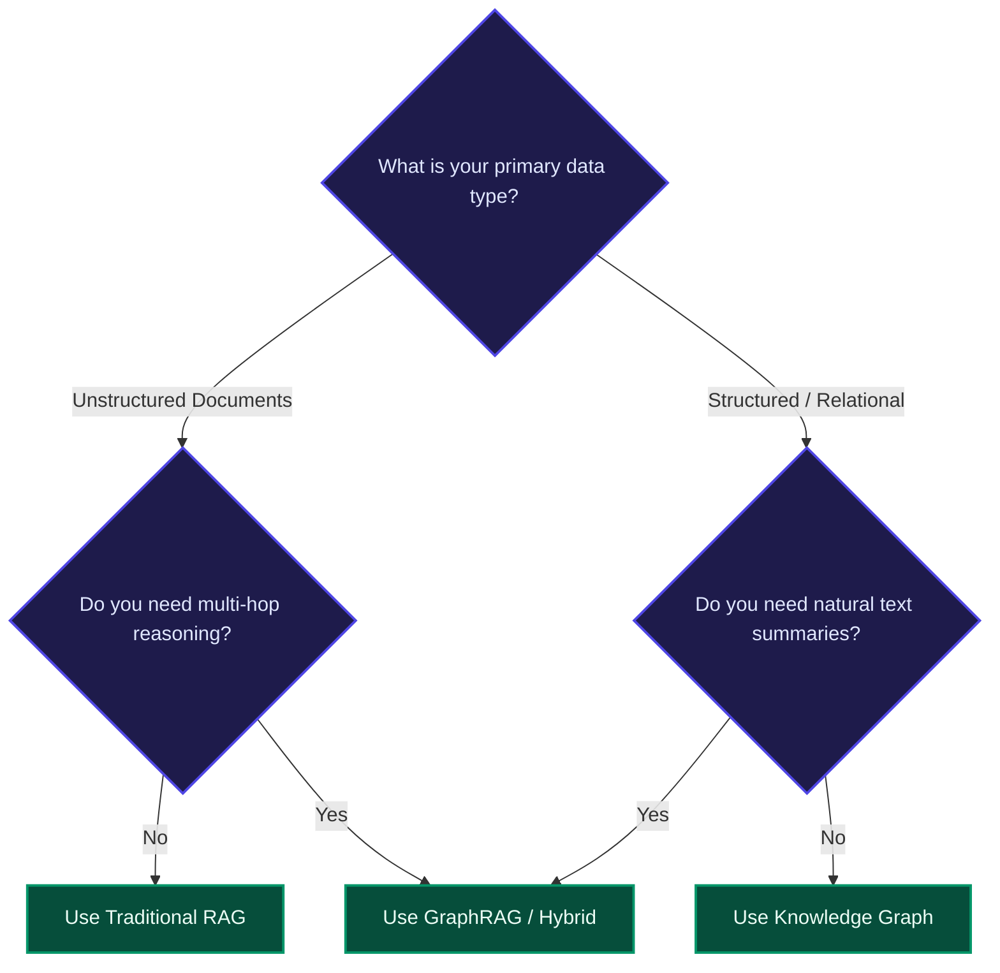
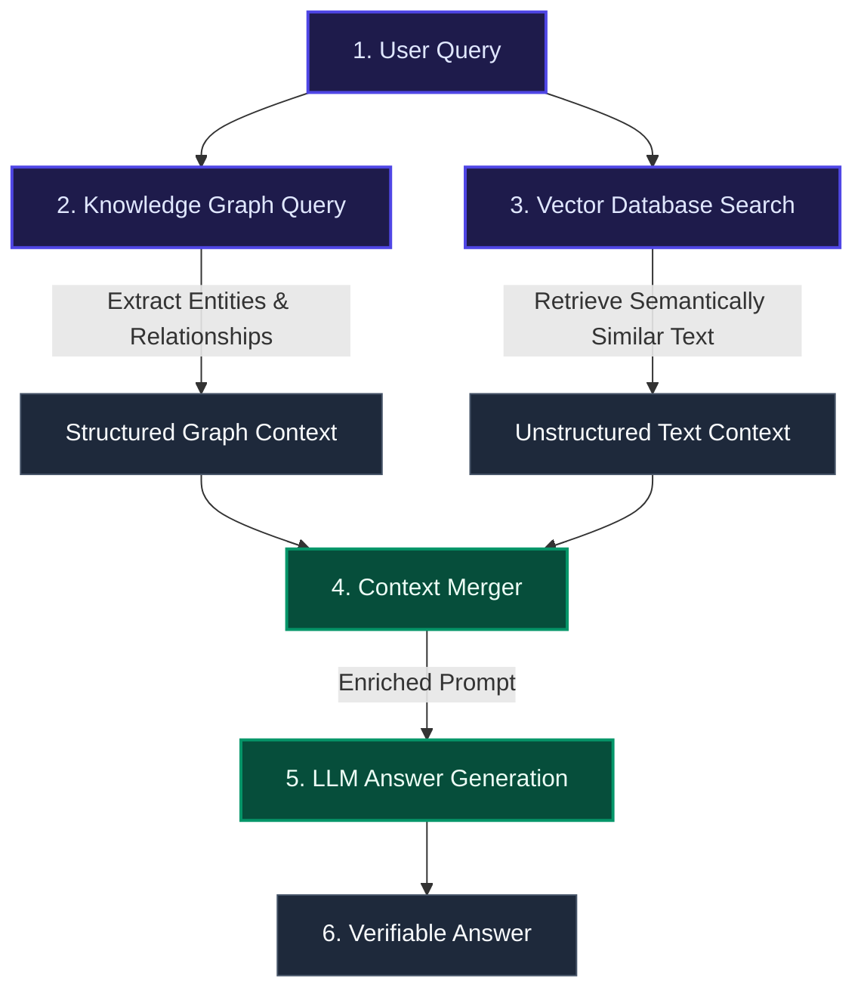

# RAG vs. Knowledge Graphs: Which Delivers Better Performance for Enterprise AI?

Enterprise AI success is no longer just about choosing the best Large Language Model (LLM). Instead, it depends on how effectively organizations retrieve, structure, and feed data to those models. Without reliable data grounding, LLMs suffer from hallucinations, inconsistency, and security risks. 

To solve this, two primary architectures have emerged: **Retrieval-Augmented Generation (RAG)** and **Knowledge Graphs**. 

---

## 📋 TL;DR Summary

*   **RAG** excels at speed, flexibility, and retrieving information from unstructured text (like PDFs, emails, and markdown files).
*   **Knowledge Graphs** deliver absolute accuracy, explainable reasoning paths, and strict data governance.
*   **GraphRAG (Hybrid)** combines both systems, emerging as the modern enterprise standard.
*   **The choice** depends on your query complexity, need for auditability, and available budget.

---

## ⚡ Why Data Architecture Matters for Enterprise AI Strategy

According to industry research (such as Gartner and McKinsey), the majority of enterprise AI project failures stem from data quality and context issues, not the LLM itself. Up to $60\%$ of AI initiatives struggle due to poor data foundations. 

To bridge this gap, developers must choose the right context retrieval layer:

*   **RAG** focuses on fetching relevant document snippets at runtime and feeding them to the LLM.
*   **Knowledge Graphs** explicitly define how concepts, facts, and rules connect, allowing the LLM to reason step-by-step.

> [!WARNING]
> Choosing the wrong architecture can lead to:
> *   **Hallucinations** (traditional RAG without strict verification).
> *   **Incomplete answers** (RAG failing to connect facts spread across different documents).
> *   **High development costs** (building over-engineered graphs for simple search tasks).

---

## 🔍 Understanding RAG Architecture

### What is RAG?
RAG (Retrieval-Augmented Generation) is an architectural pattern that improves LLM answers by searching external files for facts before letting the model write a response.

```
[User Query] ➔ [Convert to Vector] ➔ [Scan Vector DB] ➔ [Retrieve Snippets] ➔ [LLM Response]
```

### Why RAG is the Baseline Standard
*   **Handles Unstructured Data**: Easily parses PDFs, support logs, emails, and spreadsheets.
*   **Fast Implementation**: Can be set up in days using open-source vector databases.
*   **No Model Retraining**: Keeps answers fresh by updating the database index, not the model weights.

### Key Limitations of RAG
*   **No Deep Reasoning**: RAG retrieves text blocks but does not understand how a fact in *Doc A* connects to a fact in *Doc B*.
*   **Information Silos**: Information remains isolated within separate files.
*   **Black Box Matching**: Vector search uses mathematical similarity, which can sometimes retrieve unrelated words or miss exact identifiers.

---

## 🕸️ Understanding Knowledge Graphs

### What are Knowledge Graphs?
A Knowledge Graph stores information as an interconnected network of facts. 

*   **Nodes**: The entities (nouns like `User`, `Server`, or `Location`).
*   **Edges**: The relationships (verbs like `OWNS`, `DEPENDS_ON`, or `REPORTS_TO`).
*   **Ontology**: A formal schema defining the rules of what nodes and edges are allowed to connect.

### Why Knowledge Graphs are Resurging
As AI enters regulated industries (like finance, healthcare, and supply chain), organizations require absolute trust. Knowledge graphs provide:
*   **Deterministic Accuracy**: Relationships are hard-coded, eliminating model guessing.
*   **Explainable AI**: The system can show the exact path of connections used to find an answer.
*   **Strict Governance**: Ontologies enforce rules, making it impossible to map illegal or incorrect relationships.

### Key Limitations of Knowledge Graphs
*   **High Setup Complexity**: Creating ontologies and cleaning data requires significant domain expertise.
*   **Slower Time-to-Value**: Building and deploying a comprehensive graph takes longer than indexing text for RAG.
*   **Maintenance Overhead**: Keeping the graph updated as new records arrive requires continuous database management.

---

## 📊 Core Architectural Differences

| Dimension | Retrieval-Augmented Generation (RAG) | Knowledge Graph |
| :--- | :--- | :--- |
| **Data Format** | Unstructured text documents (PDFs, markdown, logs). | Structured entities, properties, and relationships. |
| **Retrieval Method** | Probabilistic vector similarity (semantic match). | Deterministic path traversal (exact link walking). |
| **Explainability** | Low (returns similarity scores). | High (returns traceable database paths). |
| **Reasoning Ability** | Limited to single-document lookups. | Advanced (handles multi-hop connection queries). |
| **Setup Speed** | Very fast (days to weeks). | Slower (weeks to months). |
| **Scalability** | High horizontal scaling. | Moderate (complex queries can impact latency). |

### Query Comparison: Single-Step vs. Multi-Hop
*   **Single-Step (RAG Strength)**: *"What is our company's paternity leave policy?"* (Pulls the policy PDF chunk).
*   **Multi-Hop (Knowledge Graph Strength)**: *"Which clients bought Product X and then closed their accounts after speaking with support agent Y?"* (Walks from client nodes to product nodes, through interaction nodes, to agent nodes).

---

## 🎯 Decision Framework: When to Use Which?



### Choose Traditional RAG When:
*   Your data is saved inside text files, policies, or manuals.
*   You need a search assistant or chatbot up and running quickly.
*   You are operating under a tight budget.

### Choose Knowledge Graphs When:
*   Relationships and connections are the core value of your data (e.g. fraud detection, network mapping).
*   Compliance and audit rules demand $100\%$ explainable data paths.
*   Your data is already stored in structured databases.

### Choose GraphRAG (Hybrid) When:
*   You have a mix of structured tables and unstructured documents.
*   You need to answer both local search questions and global, system-wide summary questions.

---

## 🔗 Hybrid Architecture: The Future of Enterprise AI

Most advanced enterprises eventually combine both patterns into **GraphRAG**. This merges the flexible text retrieval of RAG with the structured reasoning of a Knowledge Graph.



### Key Benefits of the Hybrid Approach
1.  **Context Precision + Broad Recall**: You get the semantic coverage of text search combined with the relationship accuracy of graphs.
2.  **Minimized Hallucinations**: Multiple layers of grounding ensure the LLM only writes answers supported by both document files and structured relations.
3.  **Traceable Explanations**: Citations link directly back to source documents and graph paths.

---

## 💰 Cost, Maintenance, and Operational Trade-offs

| Cost Factor | RAG | Knowledge Graph | GraphRAG (Hybrid) |
| :--- | :--- | :--- | :--- |
| **Setup Cost** | **Low**: Simple vector indexing. | **High**: Schema design, entity resolution. | **High**: Graph building + vector indexing. |
| **Maintenance** | **Low**: Automated document refresh. | **High**: Manual schema updates, node cleaning. | **Moderate**: Automated LLM graph builders. |
| **Query Latency** | **Fast**: Optimized vector scans. | **Variable**: Deep graph walks can slow down. | **Balanced**: Hybrid cache layers help. |
| **Inference Cost** | **High**: Passing long text blocks. | **Low**: Structured facts use fewer tokens. | **Moderate**: Filtered context limits token waste. |

---

## 🚀 Enterprise Implementation Strategy

If you are building an AI data pipeline, follow an incremental approach:

*   **Step 1: Start with RAG**: Build a simple vector-based retriever to unlock value from your unstructured documents.
*   **Step 2: Layer a Knowledge Graph**: Identify your key business entities (e.g., customers, products, transactions) and construct a graph mapping how they relate.
*   **Step 3: Transition to Hybrid (GraphRAG)**: Connect the text chunks to the graph nodes, feeding both structured facts and raw text to your LLM prompt context.

---

## ❓ Frequently Asked Questions

### 1. What is the main difference between RAG and Knowledge Graphs?
RAG fetches text snippets using similar wording, whereas a Knowledge Graph follows defined data relationships to find connected facts.

### 2. Can RAG replace a Knowledge Graph?
No. RAG cannot natively perform multi-hop reasoning or map complex network relationships across different files without risking hallucinations.

### 3. Which is more expensive?
Knowledge Graphs are more expensive upfront due to data modeling and ontology design. However, they can reduce day-to-day LLM usage costs because structured data uses fewer tokens than large blocks of raw text.

### 4. What is the advantage of a hybrid model?
A hybrid model (GraphRAG) allows the LLM to access the raw document library while using a conceptual map to understand how all the documents connect.
