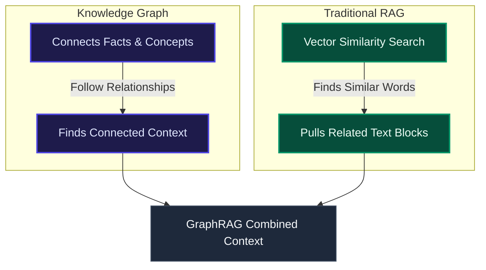

# Knowledge Graph vs. RAG: Know the Differences

Large Language Models (LLMs) are great at writing fluent text, but they can still give incorrect answers. This happens because they are trained on a fixed set of data and do not automatically search for new facts when you ask them a question. When they do not know the answer, they often make up realistic-sounding details, which is called hallucination.

**Retrieval-Augmented Generation (RAG)** solves this by feeding fresh, external information to the LLM when you ask a question. This grounds the LLM's answers in actual facts.

Traditional RAG searches for relevant document parts in a vector database. **GraphRAG** improves this by adding a **Knowledge Graph** to connect related facts and documents.

---

## ⚖️ Knowledge Graph vs. RAG: At a Glance

---

## 🕸️ What is a Knowledge Graph?

A **Knowledge Graph** stores information as a network of connected facts. It has three main building blocks:

*   **Nodes**: The things or concepts (like a `User`, a `Product`, or a `Location`).
*   **Edges**: The relationships that connect them (like `PURCHASED`, `DEPENDS_ON`, or `LIVES_IN`).
*   **Properties**: Extra details about the nodes or edges (like a user's `creation_date` or a product's `price`).

### Why Relationships Matter
By treating connections as first-class data, a knowledge graph lets you ask questions that span multiple steps:
*   *"Which customers bought a product that has been flagged as defective?"*
*   *"Which servers can access our database through a series of network connections?"*

In a traditional database, answering these questions requires complex and slow table merges (`JOIN`s). In a graph database, the engine simply follows the visual path from one node to the next.

Knowledge graphs are highly flexible. You can add new nodes, properties, or relationship types at any time without rebuilding the database.

---

## 🔍 What is Retrieval-Augmented Generation (RAG)?

**RAG** is a design pattern that fetches relevant data and gives it to the LLM to read before answering. This is much cheaper and faster than retraining the LLM every time your data changes.

### How Traditional RAG Works
1.  **Retrieval**: The system searches a vector database to find text chunks that match the wording of your question.
2.  **Generation**: The system takes those text chunks and passes them to the LLM as the source text to write the final answer.

### Main Limitations of Traditional RAG
*   **Similar Wording is Not True Relevance**: Standard vector search can find paragraphs that use similar words but do not actually answer your question.
*   **Isolated Data**: Chunks of text are treated as independent pieces. The database does not know if a person mentioned in document A is the same person mentioned in document B.
*   **Prompt Overload**: Traditional RAG often dumps entire paragraphs into the LLM, which can be noisy and exceed the LLM's memory limit.

---

## 🔗 Knowledge Graph RAG (GraphRAG)

**GraphRAG** combines a vector database with a knowledge graph. Instead of just searching for text chunks, it pulls the connections between the facts mentioned in those chunks.

It uses two parallel search channels:
1.  **Text Channel (Traditional RAG)**: Finds text chunks using vector search.
2.  **Graph Channel (Knowledge Graph)**: Identifies key entities in your query and pulls the subgraphs and relationships that connect them.

The system merges these two channels into a single prompt. The LLM gets the raw text documents *plus* a map of how the facts in those documents connect, resulting in highly accurate answers.

---

## 📊 Side-by-Side Comparison

| Feature | Knowledge Graph | Traditional RAG |
| :--- | :--- | :--- |
| **Core Purpose** | Maps out how concepts and entities are connected. | Fetches external documents to feed to the LLM at query time. |
| **Primary Output** | Paths, connected nodes, and relationships. | Text snippets and paragraphs. |
| **Great For** | Complex connections, multi-step queries, and lineage tracking. | Simple document search, question-answering, and summaries. |
| **How it Updates** | Updates incrementally as individual facts change. | Requires rebuilding, re-embedding, and re-indexing text files. |
| **Query Focus** | *"How is X connected to Y?"* | *"What does the text say about X?"* |

---

## 📅 A Brief History

### Knowledge Graphs
Knowledge graphs developed in the late 1990s and 2000s under semantic standards like RDF and SPARQL. In 2012, Google popularized the term when they added a "Knowledge Graph" to power search results panels. Property graphs grew popular in the 2010s to map data in production systems (like fraud detection and security maps).

### Retrieval-Augmented Generation (RAG)
RAG was popularized in 2020 by Facebook researchers to solve LLM hallucination and outdated training data. The main focus since then has been optimizing retrieval speed, context relevance, and expanding search to images, audio, and video files.

---

## 🎯 Which is Best: Knowledge Graph or RAG?

They are not competitors; they work at different layers of your application.

*   **Choose Knowledge Graphs** when you need a unified view of structured data across different sources, and want to track clear relationships.
*   **Choose RAG** when you want to make general documents (PDFs, wikis, logs) searchable and reduce LLM hallucinations.
*   **Use GraphRAG** when your vector search system fails to connect the dots across different documents, or when you need to summarize themes across your entire dataset.
