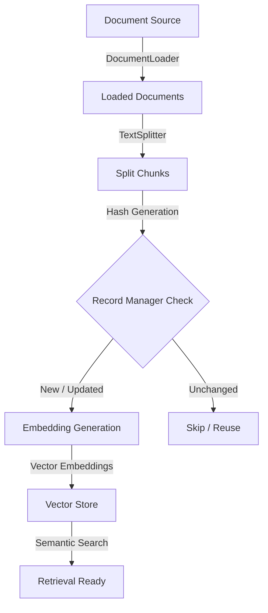

# Indexing in LangChain

*Last Updated: Sep 29, 2025*

Indexing in LangChain is the process of organizing documents in a vector database such that a language model can quickly find and use them. It works by turning documents into embeddings and keeping them synchronized in the store.

The Indexing API makes this easier by managing updates, avoiding duplicates, and skipping re-computation for unchanged content.

---

## 🏗️ Architecture



---

## 💡 Importance of Indexing

Here’s why indexing matters when building retrieval-based systems (RAG) in LangChain:

*   **Efficiency and Cost Savings**: Vector stores skip redundant computations, prevent duplication, and support incremental updates to save storage and compute.
*   **Data Accuracy and Freshness**: Keeps the vector store synchronized with source documents, removes outdated content, and maintains correct chunk mappings.
*   **Operational Benefits**: Simplifies pipelines, improves overall RAG performance, and supports multiple indexing strategies.
*   **Core Functional Role**: Organizes documents for efficient semantic search, providing accurate, context-aware information for LLMs.

---

## 🗂️ Types of Indexes in LangChain

Different types of indexing are used in LangChain to organize and search data depending on the needs of the application:

1.  **Vector Index**: Stores document embeddings in a vector database for semantic search in RAG pipelines.
2.  **Keyword Index**: Uses inverted indexes for fast keyword-based exact matches.
3.  **Hybrid Index**: Combines vector and keyword indexes to support both semantic and exact search.
4.  **Metadata Index**: Organizes documents by metadata (like author, date, or tags) for structured filtering.
5.  **Document Index**: Stores raw documents or chunks with metadata as the base for further processing.

---

## 🛠️ How Indexing Works

1.  **Document Loading**: Load data from sources like text files, PDFs, websites, or APIs using a `DocumentLoader`.
2.  **Text Splitting**: Break large documents into smaller chunks with a `TextSplitter` so they fit within LLM context limits.
3.  **Hash Generation**: Create a unique hash for each chunk to check if it is new, updated, or unchanged.
4.  **Record Manager Check**: During execution, if no match is found, chunks are embedded and stored. For later runs, unchanged chunks are skipped, and only new or updated ones are processed.
5.  **Embedding Generation**: Convert text chunks into vector embeddings using models (e.g., OpenAI or HuggingFace embeddings).
6.  **Vector Store Insertion**: Store embeddings with metadata in a vector database like FAISS, Pinecone, Weaviate, etc.
7.  **Managing Outdated Documents**: Automatically remove old or deleted documents to keep the index up to date.
8.  **Retrieval Ready**: The indexed data can now be searched semantically to fetch relevant chunks for the LLM.

---

## 💻 Implementation Example

### Step 1: Install Dependencies
Install LangChain core, OpenAI integration, FAISS for vector storage, and community modules:

```bash
pip install langchain langchain-openai faiss-cpu python-dotenv langchain-community
```

### Step 2: Import Libraries
```python
import os
from langchain_openai import OpenAIEmbeddings
from langchain_community.document_loaders import TextLoader
from langchain_community.vectorstores import FAISS
from langchain_openai import ChatOpenAI
from langchain.chains import ConversationChain
from langchain.memory import ConversationBufferMemory
```

### Step 3: Environment Setup
Set up the environment API keys (OpenAI, Gemini, etc.):

```python
os.environ["OPENAI_API_KEY"] = "your-api-key"
```

### Step 4: Load Documents
```python
loader = TextLoader("sample_document.txt")
documents = loader.load()
```

### Step 5: Create and Store Embeddings
Generate vector embeddings and store them in FAISS:

```python
embeddings = OpenAIEmbeddings()
vectorstore = FAISS.from_documents(documents, embeddings)
```

### Step 6: Retrieval
Retrieve the most relevant document chunks based on a query:

```python
retriever = vectorstore.as_retriever()
query = "What is the company policy on remote work?"
results = retriever.invoke(query)

print(results[0].page_content)
```

---

## 🔄 Indexing vs Retrieval

| Aspect | Indexing | Retrieval |
| :--- | :--- | :--- |
| **Definition** | The process of preparing, chunking, embedding, and storing documents in a vector store. | The process of searching the vector store to fetch relevant chunks for a query. |
| **When it Happens** | Done during data preparation or updates to source documents. | Done at query time when the LLM needs context to answer. |
| **Main Goal** | Organize and synchronize data for efficient semantic search. | Provide the LLM with the most relevant and accurate context. |
| **Components** | Document loaders, text splitters, embeddings, vector stores, and record manager. | Query embedding, similarity search, and retrieval chains. |
| **Output** | A structured, latest vector index of documents. | A set of relevant document chunks passed to the LLM. |
| **Analogy** | Like creating a library catalog that organizes all the books. | Like looking up the right book or page from the catalog to answer a question. |

---

## 💼 Applications

*   **Enterprise Knowledge Management**: Indexing company manuals, policies, and reports so employees can query them instantly.
*   **Healthcare**: Organizing patient records, research papers, and treatment guidelines into searchable embeddings for clinical decision support.
*   **Research Assistance**: Indexing academic literature, author networks, and citations to accelerate knowledge discovery.
*   **Legal and Compliance**: Creating indexed repositories of laws, contracts, and precedents to assist in legal research and audits.
*   **E-learning Platforms**: Indexing lessons, quizzes, and study material so learners can receive context-aware assistance.

---

## ⚖️ Pros and Cons

### Advantages
*   **Efficient Retrieval**: Enables fast semantic search across large datasets by converting documents into vector space.
*   **Accuracy in RAG**: Improves context quality for Retrieval-Augmented Generation systems, reducing hallucinations.
*   **Scalability**: Integrates with databases like Pinecone, FAISS, or Weaviate to scale up to massive document collections.
*   **Reduced Redundancy**: Prevents duplication and avoids re-embedding unchanged documents, saving compute resources.
*   **Data Organization**: Keeps documents structured and synchronized.

### Disadvantages
*   **Computational Cost**: Generating embeddings for very large datasets requires high processing power and API costs.
*   **Storage Requirements**: Persistent vector storage demands external databases, increasing infrastructure needs.
*   **Complex Setup**: Requires configuration of pipelines, custom chunk sizes, and vector stores.
*   **Update Latency**: Frequently changing datasets require continuous re-indexing, which can impact performance.
*   **Maintenance Burden**: Indexes must be monitored, cleaned, and updated to avoid stale or duplicated data.
