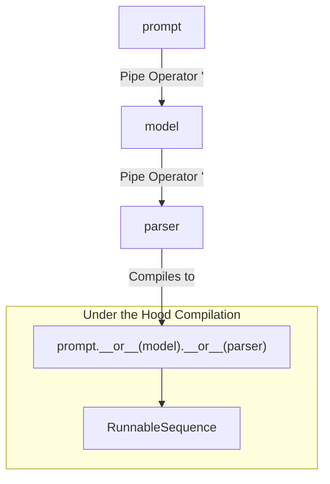

# LangChain Expression Language (LCEL)

LangChain Expression Language (LCEL) is a declarative, minimalist syntax designed to seamlessly compose, orchestrate, and deploy multi-step AI pipelines.

By taking advantage of Python's native operator overloading, LCEL allows developers to stitch together diverse LangChain components—such as Prompt Templates, LLMs, Retrievers, and Output Parsers—using the Unix-style pipe operator (`|`).

---

## 🏗️ The Core Architecture: The Pipe Operator (`|`)

LCEL eliminates the need for complex, nested boilerplate code. Instead of passing components into rigid, legacy wrapper factory classes, you lay them out side-by-side. The data flows implicitly from left to right.



### Under-the-Hood Mechanics
How does a bitwise OR symbol (`|`) connect AI components? Every component in LangChain inherits from the `Runnable` base class, which overrides Python's special dunder method `__or__`.

When the Python interpreter evaluates an LCEL expression, it dynamically compiles the components into a unified execution block:

```python
# What you write in LCEL:
chain = prompt | model | parser

# What Python executes under the hood:
chain = prompt.__or__(model).__or__(parser)
```

This compilation creates a `RunnableSequence` automatically, ensuring that the outputs of the component on the left match the expected input types of the component on the right.

---

## 💻 Code Evolution: Legacy Chains vs. Modern LCEL

To see why LCEL is an essential part of modern AI engineering, look at how the code architecture evolved:

### The Legacy Way (Pre-LCEL)
Before LCEL, you had to use explicit, rigid class constructors like `LLMChain` or `SequentialChain`. These configurations hiddenly manipulated variables, making them difficult to customize, trace, or debug.

```python
# 🚫 OLD, DEPRECATED LEGACY SYNTAX
from langchain.chains import LLMChain

chain = LLMChain(llm=model, prompt=prompt)
response = chain.run(topic="quantum computing")
```

### The Modern Way (With LCEL)
With LCEL, components are completely decoupled. The pipeline structure is fully transparent, highly readable, and easily editable.

```python
# ✅ MODERN LCEL SYNTAX
from langchain_core.prompts import ChatPromptTemplate
from langchain_core.output_parsers import StrOutputParser
from langchain_openai import ChatOpenAI

prompt = ChatPromptTemplate.from_template("Explain {topic} in one sentence.")
model = ChatOpenAI(model="gpt-4o")
parser = StrOutputParser()

# Declarative composition
chain = prompt | model | parser

# Direct invocation
response = chain.invoke({"topic": "quantum computing"})
```

---

## 🚀 The Core Benefits of LCEL

LCEL isn't just a design wrapper to make code look cleaner. Writing your pipelines using LCEL syntax automatically unlocks deep, lower-level optimization features within the execution engine:

*   **First-Class Streaming Support**: When you build a chain using LCEL, you can call `.stream()` or `.astream()` on the final sequence. LangChain will automatically stream tokens out of the language model the exact millisecond they are generated, rather than waiting for the entire pipeline to finish processing.
*   **Optimized Asynchronous Support**: Every LCEL chain natively exposes asynchronous variants of its interface (`.ainvoke()`, `.abatch()`, `.astream()`). This makes it incredibly straightforward to scale your applications inside asynchronous production web servers (like FastAPI).
*   **Implicit Parallelism**: If an LCEL chain encounters a `RunnableParallel` block, the background engine automatically spins up concurrent worker threads to execute those steps simultaneously, significantly lowering overall request latency.
*   **Native Fallbacks and Configuration**: You can append resilient runtime behaviors directly into an LCEL pipe string by using built-in helper hooks like `.with_fallbacks()` or `.with_configurable_fields()`.
*   **Seamless LangSmith Tracing**: Because LCEL maps out every stage of data transformation deterministically, monitoring platforms like LangSmith can automatically trace and visualize inputs, latent states, and token usage across every link in your chain without requiring custom logging setups.
