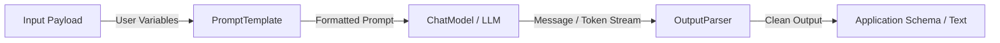

# LangChain Runnables: Comprehensive Reference Note

In LangChain, a **Runnable** is a standardized data protocol that unifies diverse AI components—such as Prompt Templates, Chat Models, LLMs, Retrievers, and Output Parsers—into a single, predictable interface.

Before the Runnable protocol, building AI applications required connecting modules with completely different function inputs and outputs. LangChain solved this by creating the **Runnable Protocol**, allowing components to seamlessly pipe data into one another using the native Python pipe operator (`|`). This orchestration design is called **LCEL** (LangChain Expression Language).

---

## 🛠️ LCEL Execution Pipeline



---

## 1. The Core Runnable Interface

Every component that inherits from the `Runnable` base class automatically gains a standard suite of execution patterns. This means any tool or chain you build can instantly handle single requests, concurrent batches, or real-time token streaming without rewriting any core logic:

*   **`.invoke(input)` / `.ainvoke(input)`**: Processes a single data payload synchronously or asynchronously.
*   **`.batch([inputs])` / `.abatch([inputs])`**: Concurrently processes an array of multiple inputs, utilizing background threading for massive speed optimization.
*   **`.stream(input)` / `.astream(input)`**: Streams the response back token-by-token (or chunk-by-chunk) as it is being generated, reducing time-to-first-token in user interfaces.

---

## 2. The Architectural Split: Workers vs. Orchestrators

To easily design complex systems in LangChain, break the Runnable ecosystem down into two distinct groups: **Task-Specific Runnables** (the physical laborers) and **Runnable Primitives** (the assembly line layout).

### A. Task-Specific Runnables (The Workers)
These modules perform concrete, domain-specific tasks. They are the actual data transformers inside your pipeline:

*   **Prompt Templates (`ChatPromptTemplate`)**: Takes raw user variables and shapes them into formatted instructions or message lists.
*   **Language Models (`ChatOpenAI`, `ChatAnthropic`)**: Connects to AI models to process inputs and return text tokens or structured function calls.
*   **Retrievers (`VectorStoreRetriever`)**: Takes a textual query string and surfaces matching document snippets from an indexed database.
*   **Output Parsers (`StrOutputParser`, `JsonOutputParser`)**: Cleans raw AI message models and reformats them into simple strings, Python dictionaries, or clean application schemas.

### B. Runnable Primitives (The Orchestrators)
Primitives don't understand data or models; their sole job is to provide the structural pathways that control how data is shaped, held, and routed between your worker components:

*   **`RunnableSequence` (The Sequential Chain)**: Connects a series of Runnables linearly from left to right (`A | B | C`). The output of one link automatically becomes the input of the next.
*   **`RunnableParallel` (The Forking Structure)**: Accepts a dictionary of tasks, passes the exact same input data payload to all of them at once, and executes them concurrently to save time.
*   **`RunnablePassthrough` (The Data State Highway)**: Forwards input variables unchanged or appends new keys to an active dictionary payload. This keeps original user strings from being overwritten by intermediate data-fetching blocks.
*   **`RunnableLambda` (The Custom Function Wrapper)**: Instantly upgrades any custom native Python function into a fully compliant LangChain Runnable, letting you embed arbitrary data-cleaning code right into the middle of a pipeline.
*   **`RunnableBranch` (The Conditional Router)**: Implements dynamic runtime routing logic. It acts as an `if/else` statement inside your chain, inspecting data variables to pass the workflow down to the perfect specialized worker.
*   **`RunnableBinding` (Parameter Hardcoding)**: Binds static execution rules, temperature constants, or system tools to a Runnable at runtime without completely re-instantiating the underlying component object.

---

## 3. Production Resiliency Features

Because everything inside an LCEL chain shares the same Runnable DNA, you can easily attach advanced enterprise-grade resilience hooks onto any component or sequence:

### Fallbacks (`.with_fallbacks()`)
Allows you to attach backup mechanisms to catch API rate limits, provider outages, or network dropouts. If the primary Runnable fails, the system instantly switches to your secondary fallback chain:

```python
# If OpenAI hits a rate limit or goes down, LangChain instantly fails over to Anthropic
resilient_model = openai_model.with_fallbacks([anthropic_model])
```

### Configurable Fields (`.with_configurable_fields()`)
Allows you to flag certain structural parameters (like temperature, max tokens, or specific model engines) as dynamically adjustable options when calling `.invoke()`, completely bypassing the need to hardcode separate chains:

```python
flexible_model = chat_model.with_configurable_fields(
    temperature=ConfigurableField(id="runtime_temp")
)

# Alter execution configurations dynamically on the fly during invocation
flexible_model.invoke("Write a pitch", config={"configurable": {"runtime_temp": 0.9}})
```
