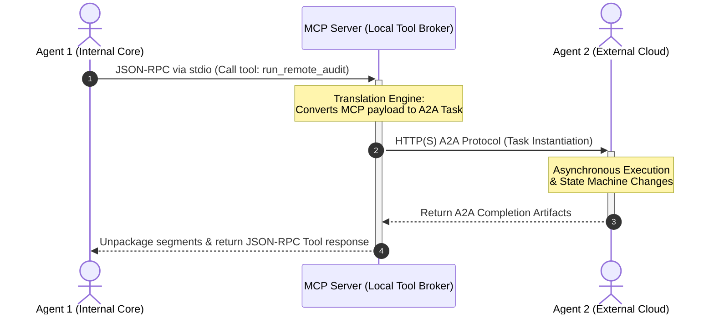
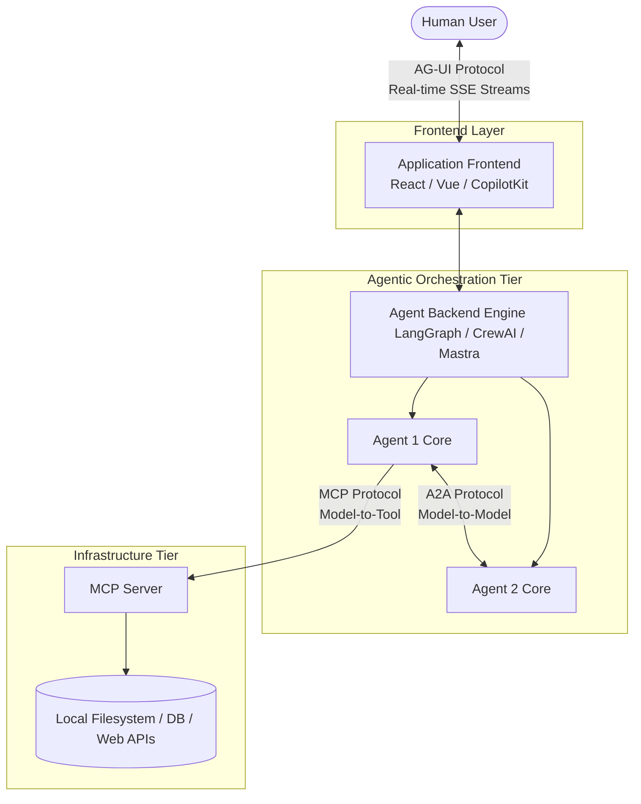

# 🧠 AI Engineering Study Notes: Agentic Interoperability Frameworks

This technical reference note establishes the architectural definitions, behavioral properties, and implementation paradigms comparing the **Model Context Protocol (MCP)**, the **Agent2Agent (A2A) Protocol**, and the **Agent-User Interaction (AG-UI) Protocol** within modern enterprise-scale AI engineering.

To understand the big picture immediately:
*   **MCP** standardizes how an **Agent talks to Tools**.
*   **A2A** standardizes how an **Agent talks to other Agents**.
*   **AG-UI** standardizes how an **Agent talks to the Human User Interface (UI)**.

---

## ⚖️ 1. Core Architectural Taxonomy

| Operational Dimension | Model Context Protocol (MCP) | Agent2Agent (A2A) Protocol | Agent-User Interaction (AG-UI) Protocol |
| :--- | :--- | :--- | :--- |
| **Primary Integration Axis** | 🔺 Vertical (Model-to-Infrastructure) | ↔️ Horizontal (Model-to-Model) | 📥 Front-to-Back (Model-to-User Interface) |
| **Core Abstraction** | $\text{Model} \longleftrightarrow \text{Data / Env Interface}$ | $\text{Agent} \longleftrightarrow \text{Agent Lifecycle}$ | $\text{Agent} \longleftrightarrow \text{Human UI Interface}$ |
| **Transport Standard** | JSON-RPC 2.0 over Standard I/O or SSE | JSON-RPC 2.0 / REST over HTTP(S) | Server-Sent Events (SSE) Streams |
| **Governance Custody** | Agentic AI Foundation (under Linux Foundation) | Linux Foundation (Contributed by Google) | Open Source (CopilotKit) |
| **Design Inspiration** | **Language Server Protocol (LSP)**: Solves the $N \times M$ integration bottleneck between custom models and tools. | **Network Messaging Tier**: Solves cross-framework execution barriers across heterogeneous agent platforms. | **Universal Event Layer**: Solves the frontend state synchronization and streaming bottleneck. |
| **Simple Analogy** | An AI's Hands (Plugging into local tools). | An AI's Phone (Calling a teammate to delegate work). | An AI's Face/Voice (Interacting dynamically with the user). |

---

## 🗺️ 2. The Three Layers of the Stack

To understand the landscape, think of building an AI-powered enterprise application like setting up a corporate company:

### 1. AG-UI (Agent-User Interaction) — The Human Interface
*   **The Analogy**: The customer service window or the office phone line where humans talk to the business.
*   **The Concept**: Standardizes how the backend agent framework streams real-time updates (tokens, tool usage states, and status changes) cleanly back to the user interface (frontend) using Server-Sent Events (SSE).

### 2. A2A (Agent-to-Agent) — The Corporate Network
*   **The Analogy**: Managers delegating work to peer employees or talking to external vendor companies.
*   **The Concept**: Standardizes how completely independent AI agents running on different servers discover each other (via Agent Cards), pass task tickets, track job states, and coordinate complex, multi-agent workflows.

### 3. MCP (Model Context Protocol) — The Workplace Utilities
*   **The Analogy**: The computers, database software, spreadsheets, and equipment that the workers use to do their actual day-to-day physical jobs.
*   **The Concept**: Standardizes how a single AI model plugs into local data files, reads internal company databases, or hooks up to web APIs safely using a universal client-server architecture.

---

## 🔺 3. Deep Dive: Model Context Protocol (MCP)

MCP addresses the architectural challenge of information silos and tight, vendor-specific coupling (e.g., custom, brittle function-calling code written for one specific model family). It treats an AI model as an opaque processing core that requires a standardized "hardware-like port" to interact with surrounding compute infrastructure.

### 🏗️ The 3 Core Sub-components
1. **MCP Host**: The execution frame hosting the core language model instance (e.g., Cursor IDE, Claude Desktop, custom enterprise workspaces).
2. **MCP Client**: The network handler inside the host workspace that serializes model intents into JSON-RPC compliant structures.
3. **MCP Server**: A lightweight microservice layer wrapping around real-world data and software layers (e.g., local filesystems, a SQL database, or safe Slack/GitHub API integrations).

### 🛠️ The 3 Server Capabilities
*   **📂 Resources**: Read-only string or binary blobs that expose background data contexts cleanly to the model (e.g., files, log readings).
*   **📝 Prompts**: Server-side template configurations that allow models to safely query for baseline execution blueprints.
*   **⚙️ Tools**: Actionable, executable functions that let the model perform structural system modifications (e.g., running code, modifying database entries).

> **Core Takeaway**: MCP is internal and vertical. It gives a single AI agent secure "hands" to manipulate data and use local tools safely.

---

## ↔️ 4. Deep Dive: Agent2Agent (A2A) Protocol

The A2A protocol targets the orchestration tier where autonomous, self-directed applications running entirely on different framework architectures (e.g., a LangGraph agent running on AWS communicating with a CrewAI agent hosted on Google Cloud) must coordinate long-term, multi-step operations.

### 🔄 The 4-Step A2A Execution Lifecycle

1.  **Discovery via AgentCard**: An A2A Client queries a system endpoint at the standardized routing location: `/.well-known/agent.json`. The server model returns a structural metadata document (the **Agent Card**), exposing its capabilities, operational modalities (text, audio, interactive grids), and enterprise authentication rules.
2.  **Task Instantiation**: The client issues a structural `Message`. The A2A Server intercepts this state internally as an abstract `Task`.
3.  **State Machine Regulation**: The task transitions explicitly through a deterministic lifecycle state machine:
    $$\text{Submitted} \longrightarrow \text{Working} \longrightarrow \begin{cases} \text{Input-Required} \\ \text{Completed} \\ \text{Failed} \end{cases}$$
4.  **Artifact Extraction**: Upon completion, the server streams back final deliverables—known as **Artifacts**—composed of specific payload segments called **Parts** (e.g., `TextPart`, `FilePart`, `DataPart`).

> **💡 The Principle of Opacity**: A2A treats all cooperating agents as completely black-box applications. No agent needs to reveal its inner weights, prompt histories, system instructions, or internal database mechanisms to its peer to collaborate. This guarantees strict data boundaries and enterprise intellectual property protection.

---

## 🔗 5. Advanced Composition: Mixed Protocol Routing Patterns

In production-grade AI environments, engineers deliberately arrange these protocols together to achieve strict operational decoupling, data sandboxing, and secure external tool execution.

### Pattern: Agent 1 ──► MCP ──► A2A ──► Agent 2

This specific architectural layout is designed for **Proxy-Mediated Agent Delegation**. Agent 1 does not retain a direct open network path to Agent 2; instead, a local MCP server handles the protocol bridge dynamically.

### ⚙️ Architectural Mechanics
1. **Local Execution Isolation**: Agent 1 triggers a local function tool call exposed through its native host environment via its MCP Client. It assumes it is calling an analytical code snippet hosted locally inside its immediate environment boundary.
2. **Protocol Refactoring Layer**: The local MCP Server intercepts the JSON-RPC function call parameters. Instead of executing processing threads inside its own process namespace, it dynamically maps those input arrays into an outbound A2A Message payload.
3. **Opaque Task Delegation**: The server acts as an A2A Client, querying the remote Agent 2's public matching endpoint found on its declared AgentCard. The task is sent, evaluated across the internet, and monitored securely.
4. **Asynchronous State Return**: Once Agent 2 streams the completion artifacts back across the HTTP network, the internal broker server unpackages the data segments, formats them back into a clean standard tool response object, and pushes it back into Agent 1's context window.

### 🛡️ Why Engineers Implement this Loop
*   **Absolute Sandbox Separation**: The internal agent (Agent 1) remains completely blind to external network configurations, minimizing prompt injection attack planes and data exfiltration avenues.
*   **Dynamic Upstream Substitution**: The tool abstraction allows engineers to hot-swap, upgrade, or change Agent 2 with an alternate model vendor on the fly without changing a single line of application source code inside Agent 1.

---

## 📥 6. Deep Dive: Agent-User Interaction (AG-UI) Protocol

The **AG-UI Protocol** targets the frontend rendering layer. It solves the frontend bottleneck that occurs when building rich user interfaces for autonomous agents.

### 1. The Core Problem: The Frontend Bottleneck
When building agentic applications using backends like LangGraph, CrewAI, or Mastra, engineers run into a major issue when trying to build a real-world web or mobile app interface. Every single agent framework has its own custom, messy way of handling:
*   Streaming raw text tokens.
*   Reporting which tool is currently running and its execution progress.
*   Asking a human for permission/feedback mid-run (Human-in-the-loop).
*   Handling a user interrupting or canceling a running agent task.

If you build a React frontend explicitly for LangGraph, your code will be filled with custom WebSocket listeners and rigid JSON state parsers. If you decide to migrate your backend to CrewAI, your entire frontend breaks and must be rewritten. This does not scale.

### 2. The Solution: AG-UI Protocol
Open-sourced by **CopilotKit**, AG-UI acts as a standardized, universal middle layer between any agentic backend and any frontend user interface. Instead of writing custom integrations for every framework, your backend framework emits a standardized AG-UI event, and your frontend app naturally renders it.

### 3. How It Works Under the Hood
AG-UI uses **Server-Sent Events (SSE)** to maintain an open, real-time stream from the agent backend to the frontend UI. Instead of sending raw text, it passes structured JSON event payloads containing four explicit keys:

| Event Payload Type | What It Triggers in the UI |
| :--- | :--- |
| 💬 `TEXT_MESSAGE_CONTENT` | Streams tokens smoothly onto the screen for the user to read. |
| ⚙️ `TOOL_CALL_START` | Animates a loading state or card showing the user exactly what tool the agent is running right now. |
| 📊 `STATE_DELTA` | Updates complex UI shared states (like updating a code editor panel or re-rendering a data table) without refreshing the screen. |
| 🔄 `AGENT_HANDOFF` | Smoothly signals the UI that control is shifting from Agent A to Agent B. |

---

## 🛠️ 7. Where CopilotKit Fits Into the Landscape

While MCP, A2A, and AG-UI are excellent protocols (the theoretical rules), implementing them raw from scratch in production code is incredibly complex. You would have to manually configure SSE streams, write custom JSON-RPC network abstraction wrappers, and manage raw asynchronous states.

**CopilotKit** acts as the practical software layer that unifies all three protocols:

*   **On the Backend**: It provides pre-built adapters to easily plug into your agentic backend frameworks of choice (LangGraph, CrewAI, Autogen, LlamaIndex, etc.).
*   **On the Tooling Side**: It handles wrapping your local systems and web APIs into compliant MCP servers automatically.
*   **On the Frontend**: It gives developers plug-and-play UI components (like side-panels, popups, and generative canvas elements) that natively know how to listen to AG-UI event payloads (like `TEXT_MESSAGE_CONTENT` or `TOOL_CALL_START`).

---

## 🗺️ 8. The Unified Agent Architecture (The Complete Stack)

Now that you have studied MCP, A2A, and AG-UI, you can visualize the complete modern stack for an enterprise AI Application:

### Why this architecture makes AI feel like real software:
*   **Frontend Decoupling**: You can swap your AI model (e.g., switching GPT-4 for a local Llama-3 instance) or entirely change your agent framework, and your frontend user interface doesn't change a single line of code.
*   **True State Synchronization**: Large objects like interactive code blocks, canvases, or tables update dynamically as the agent "thinks" and applies tools in the background.
*   **Seamless Interruption**: Users can talk back to, pause, or adjust the agent mid-execution without losing the historical context of the run.

---

## 📝 Summary

This landscape is the blueprint for how AI transitions from a "glorified chatbot" into enterprise-grade software. Because these layers are decoupled, your frontend application can stay connected to the entire ecosystem through one unified protocol. 

You can swap models, update database tables, or rewrite backend agent routing rules completely, and your user-facing app will continue to function perfectly without changing a single line of frontend code.
