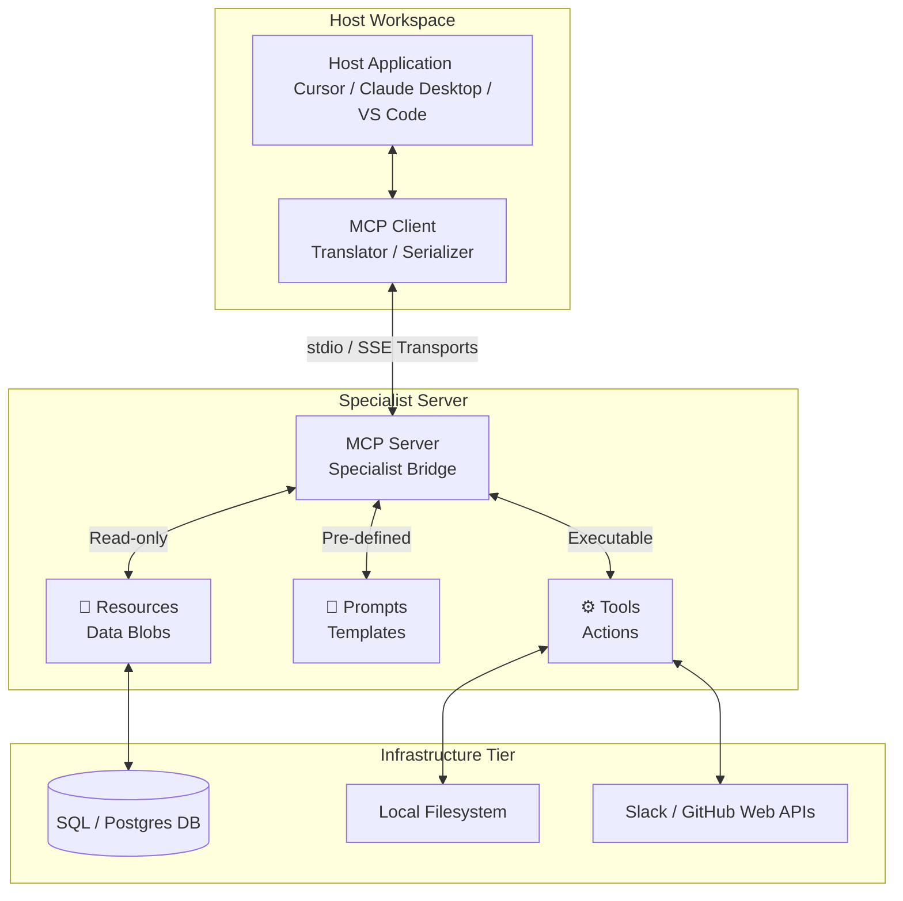

# Introduction to Model Context Protocol (MCP)

Welcome to the world of the Model Context Protocol (MCP)!

MCP is an open standard created to solve a massive problem in AI: **isolation**. By default, an LLM is trapped in a box. It doesn't know about your local files, your databases, or your web development tools unless you copy-paste them.

MCP acts like a **universal USB port for AI**. It provides a secure, standardized way for Large Language Models to safely read data and control tools on your computer or in the cloud.

---

## 🏗️ 1. The Core Architecture: Host vs. Client vs. Server

To understand how MCP works, look at the three-layer cake of the ecosystem:

### Host (The Environment)
The **Host** is the main application or workspace where you are actually interacting with the AI. It coordinates the overall session.
*   *Examples*: VS Code, Cursor, a terminal, or a dedicated AI desktop app.

### Client (The Translator)
The **Client** lives inside the Host. Its job is to maintain a secure connection and handle the protocol translation. It takes the user's intent from the Host, figures out which server can help, and passes the request down the line.

### Server (The Specialists)
An **MCP Server** is a lightweight, specialized program that exposes specific capabilities to the Client. Servers do the heavy lifting of talking to the real world.
*   *Examples*: A Postgres Database Server, a GitHub Server, or a Local Filesystem Server.

> **How they work together**: You type a prompt in your Host (VS Code). The MCP Client sees you want to read a file, so it securely requests the data from the Local Filesystem Server, which reads your hard drive and sends it back up.

---

## 🗂️ 2. Explaining the Core Terms

Once an MCP Client and Server are talking, they interact using a set of standardized capabilities:

### Resources (The Data)
Resources are **read-only data sources** that the server makes available to the AI. Think of them like files or URLs.
*   *Example*: A database server might expose a resource like `postgres://database/users_table`. The LLM can read this text to understand your data schema.

### Prompts (The Templates)
Prompts are **pre-written text templates** or shortcuts exposed by the server to help the user guide the LLM effectively.
*   *Example*: A code review server might provide a prompt called `review-pull-request`. When selected, it automatically formats a complex prompt asking the LLM to find bugs in your code.

### Tools (The Actions)
Unlike read-only resources, **Tools are executable functions** that allow the LLM to do things. The LLM decides to call a tool, and the server executes it on your machine.
*   *Example*: A filesystem tool called `write_file(filename, content)`. The LLM can actually modify a file on your computer by invoking this tool.

---

## ⚙️ 3. Advanced Management & Sampling

As you build more complex setups, you encounter terms related to how data flows and how servers are managed:

### Server Manager
A **Server Manager** is a utility tool (often built directly into advanced hosts) used to configure, boot up, and track your running MCP servers. It handles the environment variables, paths, and API tokens needed to keep your servers connected securely.

### Roots (The Boundaries)
**Roots** define the security perimeters or base paths that an MCP server is allowed to touch.
*   *Example*: If you configure a Filesystem Server, you might set its "Root" to `C:/Users/Name/Projects/MyAIApp`. The server will strictly block the LLM if it tries to read files outside of that specific directory.

### Sampling (The AI Self-Correction)
**Sampling** allows an MCP Server to ask the LLM for a response mid-operation. It flips the script: instead of the client asking the server for data, the server says, *"Hey LLM, I ran the code you gave me and got an error. Can you look at this error and give me a fix?"* This enables autonomous agent behavior.

### Elicitations
An **elicitation** is a targeted design pattern where the system deliberately prompts the user or the model to extract missing context required to fulfill a tool request. For instance, if a tool needs a specific parameter that wasn't provided, an elicitation loop pauses the execution to gather that vital token or piece of data.

---

## 🔗 4. Other Important MCP Concepts to Know

As you continue learning, keep an eye out for these terms:

### Transports
This is the underlying network highway the protocol travels on. MCP primarily uses two types of transports:
*   **stdio**: (Standard Input/Output) Used when the server is running locally on the exact same computer as your client.
*   **SSE**: (Server-Sent Events) Used over HTTP when the server is hosted remotely in the cloud.

### Capabilities Negotiation
When a Client first connects to a Server, they perform a "handshake." The server lists exactly what it can do (e.g., *"I support Resources and Tools, but I don't have any Prompts"*), so the client knows how to interact with it.

---

> **📝 Self-Reflection Question**: How are you planning to use MCP—are you trying to connect an existing coding assistant to your local databases, or are you interested in writing a custom server from scratch?
