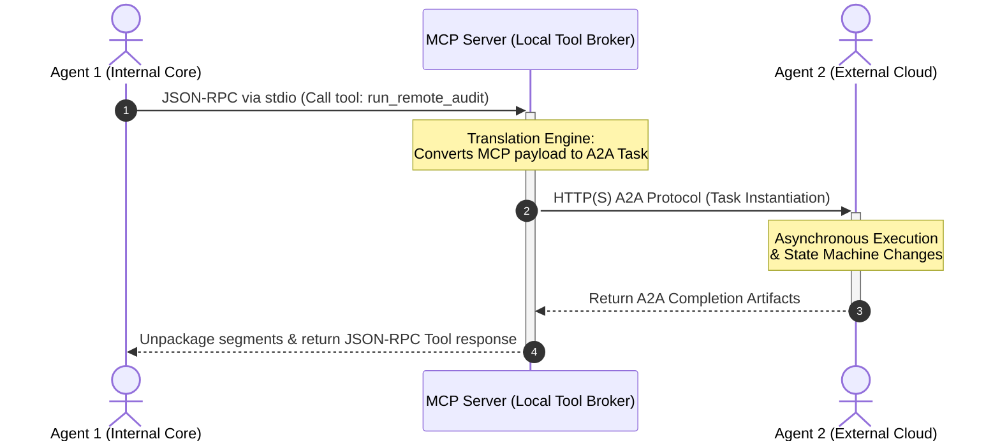

# 🧠 AI Engineering Study Notes: Agentic Interoperability Frameworks

This technical reference note establishes the architectural definitions, behavioral properties, and implementation paradigms comparing the **Model Context Protocol (MCP)** and the **Agent2Agent (A2A) Protocol** within modern enterprise-scale AI engineering.

---

## ⚖️ 1. Core Architectural Taxonomy

| Operational Dimension | Model Context Protocol (MCP) | Agent2Agent (A2A) Protocol |
| :--- | :--- | :--- |
| **Primary Integration Axis** | 🔺 Vertical Integration (Model-to-Infrastructure) | ↔️ Horizontal Integration (Model-to-Model) |
| **Core Abstraction** | $\text{Model} \longleftrightarrow \text{Data / Environment Interface}$ | $\text{Agent} \longleftrightarrow \text{Agent Lifecycle Interface}$ |
| **Transport Standard** | JSON-RPC 2.0 over Standard I/O (local) or SSE (remote) | JSON-RPC 2.0 / REST endpoints over HTTP(S) |
| **Governance Custody** | Managed by the Agentic AI Foundation (under the Linux Foundation) | Managed by the Linux Foundation (Contributed by Google) |
| **Design Inspiration** | **Language Server Protocol (LSP)**: Solves the $N \times M$ integration bottleneck between custom models and custom tools. | **Network Messaging Tier**: Solves cross-framework execution barriers across heterogeneous agent platforms. |
| **Simple Analogy** | An AI's Hands (Plugging into locally attached peripherals). | An AI's Phone (Calling an external teammate to assign work). |

---

## 🔺 2. Deep Dive: Model Context Protocol (MCP)

MCP addresses the architectural challenge of information silos and tight, vendor-specific coupling (e.g., custom, brittle function-calling code written for one specific model family). It treats an AI model as an opaque processing core that requires a standardized "hardware-like port" to interact with surrounding compute infrastructure.

### 🏗️ The 3 Core Sub-components
1. **MCP Host**: The execution frame hosting the core language model instance (e.g., Cursor IDE, Claude Desktop, custom enterprise workspaces).
2. **MCP Client**: The network handler inside the host workspace that serializes model intents into JSON-RPC compliant structures.
3. **MCP Server**: A lightweight microservice layer wrapping around real-world data and software layers (e.g., local filesystems, a SQL database, or safe Slack/GitHub API integrations).

### 🛠️ The 3 Server Capabilities
*   **📂 Resources**: Read-only string or binary blobs that expose background data contexts cleanly to the model (e.g., files, log readings).
*   **📝 Prompts**: Server-side template configurations that allow models to safely query for baseline execution blueprints.
*   **⚙️ Tools**: Actionable, executable functions that let the model perform structural system modifications (e.g., running code, modifying database entries).

> **Core Takeaway**: MCP is internal and vertical. It gives a single AI agent secure "hands" to manipulate data and use local tools safely.

---

## ↔️ 3. Deep Dive: Agent2Agent (A2A) Protocol

The A2A protocol targets the orchestration tier where autonomous, self-directed applications running entirely on different framework architectures (e.g., a LangGraph agent running on AWS communicating with a CrewAI agent hosted on Google Cloud) must coordinate long-term, multi-step operations.

### 🔄 The 4-Step A2A Execution Lifecycle

1.  **Discovery via AgentCard**: An A2A Client queries a system endpoint at the standardized routing location: `/.well-known/agent.json`. The server model returns a structural metadata document (the **Agent Card**), exposing its capabilities, operational modalities (text, audio, interactive grids), and enterprise authentication rules.
2.  **Task Instantiation**: The client issues a structural `Message`. The A2A Server intercepts this state internally as an abstract `Task`.
3.  **State Machine Regulation**: The task transitions explicitly through a deterministic lifecycle state machine:
    $$\text{Submitted} \longrightarrow \text{Working} \longrightarrow \begin{cases} \text{Input-Required} \\ \text{Completed} \\ \text{Failed} \end{cases}$$
4.  **Artifact Extraction**: Upon completion, the server streams back final deliverables—known as **Artifacts**—composed of specific payload segments called **Parts** (e.g., `TextPart`, `FilePart`, `DataPart`).

> **💡 The Principle of Opacity**: A2A treats all cooperating agents as completely black-box applications. No agent needs to reveal its inner weights, prompt histories, system instructions, or internal database mechanisms to its peer to collaborate. This guarantees strict data boundaries and enterprise intellectual property protection.

---

## 🔗 4. Advanced Composition: Mixed Protocol Routing Patterns

In production-grade AI environments, engineers deliberately arrange these protocols together to achieve strict operational decoupling, data sandboxing, and secure external tool execution.

### Pattern: Agent 1 ──► MCP ──► A2A ──► Agent 2

This specific architectural layout is designed for **Proxy-Mediated Agent Delegation**. Agent 1 does not retain a direct open network path to Agent 2; instead, a local MCP server handles the protocol bridge dynamically.

### ⚙️ Architectural Mechanics
1. **Local Execution Isolation**: Agent 1 triggers a local function tool call exposed through its native host environment via its MCP Client. It assumes it is calling an analytical code snippet hosted locally inside its immediate environment boundary.
2. **Protocol Refactoring Layer**: The local MCP Server intercepts the JSON-RPC function call parameters. Instead of executing processing threads inside its own process namespace, it dynamically maps those input arrays into an outbound A2A Message payload.
3. **Opaque Task Delegation**: The server acts as an A2A Client, querying the remote Agent 2's public matching endpoint found on its declared AgentCard. The task is sent, evaluated across the internet, and monitored securely.
4. **Asynchronous State Return**: Once Agent 2 streams the completion artifacts back across the HTTP network, the internal broker server unpackages the data segments, formats them back into a clean standard tool response object, and pushes it back into Agent 1's context window.

---

## 🛡️ Why Engineers Implement this Loop

*   **Absolute Sandbox Separation**: The internal agent (Agent 1) remains completely blind to external network configurations, minimizing prompt injection attack planes and data exfiltration avenues.
*   **Dynamic Upstream Substitution**: The tool abstraction allows engineers to hot-swap, upgrade, or change Agent 2 with an alternate model vendor on the fly without changing a single line of application source code inside Agent 1.
