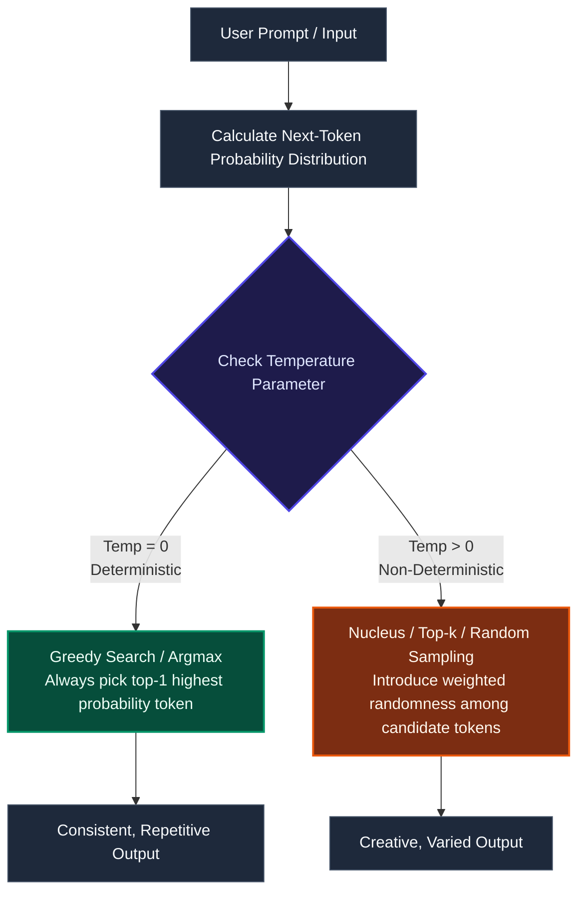

# Deterministic vs. Non-Deterministic LLMs: What’s the Difference?

*Original Author: Ambuj | June 27, 2025*

Large Language Models (LLMs) are transforming how we interact with technology. But not all LLMs behave the same way. One key distinction lies in whether they operate in a **deterministic** or **non-deterministic** manner. Understanding this difference is critical for designing robust prompt engineering patterns, software integrations, and cost-controlled AI agents.

---

## 🎲 The Core Engine: Probability & Temperature

At their core, LLMs are next-token prediction machines. When predicting the next word, the model generates a probability distribution over its entire vocabulary. The parameter that dictates how the model samples from this distribution is **Temperature**.

*   **Temperature = 0 (Deterministic)**: The model always selects the absolute highest-probability token (known as greedy decoding or *argmax*). Since there is zero randomness, the same input prompt will yield the exact same response every single run.
*   **Temperature > 0 (Non-Deterministic)**: The model applies a scaling factor to the probability distribution, flattening it to allow lower-probability words a chance of being selected. This introduces variety and creativity, but means outputs will vary from run to run.

---

## ⚖️ Key Comparison Matrix

| Operational Dimension | Deterministic LLM (D-LLM) | Non-Deterministic LLM (ND-LLM) |
| :--- | :--- | :--- |
| **Output Consistency** | **Identical**: Same input prompt produces the same output every time. | **Variable**: Same input prompt produces potentially different outputs. |
| **Control Parameters** | Temperature = `0`, Top-P = `0`, Greedy Search. | Temperature > `0` (e.g., `0.7`, `1.0`), Top-K/Top-P active. |
| **Predictability** | Highly predictable; easy to parse programmatically. | Less predictable; exhibits high linguistic variability. |
| **Use Case Fit** | Precise, factual, and structural tasks. | Creative, exploratory, and open-ended tasks. |

---

## 🛠️ Production Use Cases

### When to Use Deterministic LLMs (Temperature = 0)
Deterministic outputs are essential when consistency, structure, and reliability are critical for downstream applications:

*   **Data Extraction & JSON Parsing**: Extracting specific attributes (like dates, names, or values) into schema objects. A non-deterministic output might break JSON formatting or use alternative key names.
*   **Technical Documentation**: Generating step-by-step user manuals or API references where exactness and repeatability are paramount.
*   **Automated Customer Support**: Serving standardized troubleshooting guides (e.g., password reset steps) where giving slightly different instructions might confuse users.

> [!NOTE]
> **Example**: If a deterministic LLM is asked, *"What is the capital of France?"*, it will reliably respond with *"The capital of France is Paris."* on every execution.

### When to Use Non-Deterministic LLMs (Temperature > 0)
Non-deterministic outputs shine when you need the model to brainstorm, emulate human conversation, or generate artistic content:

*   **Creative Content Generation**: Writing marketing copy, newsletters, stories, or poetry where repetitive phrasing looks robotic.
*   **Ideation & Brainstorming**: Generating multiple distinct angles or names for a product campaign.
*   **Casual Chatbots**: Making conversational agents feel more organic, human-like, and dynamic by varying response structures.

> [!TIP]
> **Example**: Asking a non-deterministic LLM to *"describe a futuristic city"* might yield a narrative about towering glass solar-arrays on one run, and floating magnetic urban platforms on the next.

---

## 🔄 Pros & Cons

### Deterministic LLMs
> [!IMPORTANT]
> **Advantages**:
> * High reproducibility makes testing, regression evaluation, and debugging straightforward.
> * Guarantees compliance and predictability when integrating with software APIs.
>
> **Disadvantages**:
> * Can feel robotic, repetitive, or sterile.
> * Fails at open-ended creative tasks due to a lack of conceptual exploration.

### Non-Deterministic LLMs
> [!WARNING]
> **Advantages**:
> * Generates highly diverse, creative, and engaging outputs.
> * Mimics human-like variety and linguistic nuances.
>
> **Disadvantages**:
> * Unsuitable for strict data extraction because outputs may vary in format, length, or structure.
> * Harder to evaluate and debug since testing suites must handle dynamic text comparisons.

---

## 🔮 Challenges & Future Directions

1.  **Balancing Creativity and Factual Safety**: Modern hybrid AI systems often dynamically toggle parameters: using deterministic settings for factual queries (e.g., retrieving facts from a RAG pipeline) and switching to non-deterministic modes for conversational synthesis.
2.  **User-Facing Temperature Sliders**: Applications frequently expose interactive sliders (such as "Creativity level" or "Accuracy focus") to allow end users to easily control the underlying temperature thresholds.
3.  **Ethical Variability**: Non-deterministic models can occasionally output unexpected biases or hallucinated facts on different runs, necessitating the development of robust post-generation guardrails and content filters.
