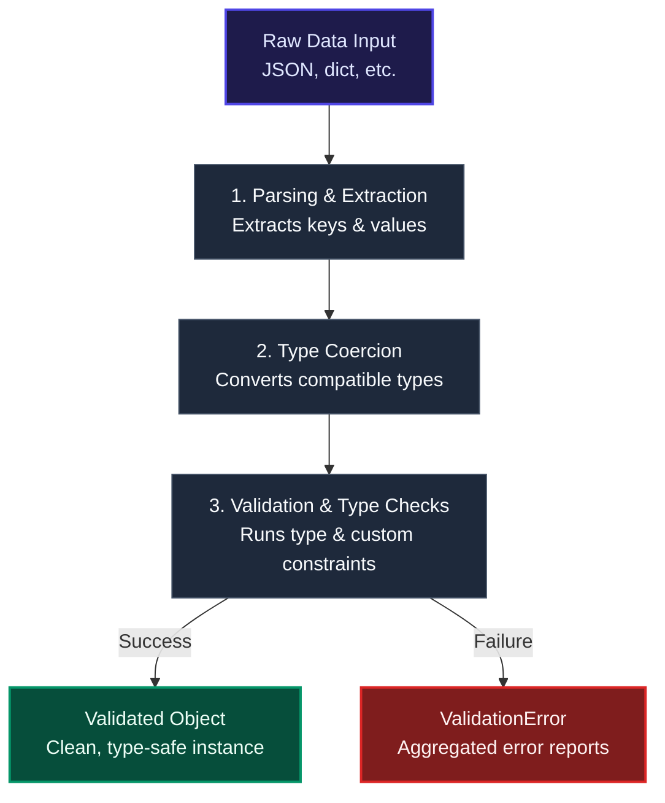

# Pydantic BaseModel: The Core Schema Engine

In Pydantic, the `BaseModel` class is the fundamental building block. It serves as the core Python class that you inherit from to define your data schemas, shapes, and runtime validation rules.

Think of `BaseModel` as a **smart factory conveyor belt**:
* You design the layout (the fields and expected data types).
* When raw, unstructured data (such as a JSON payload or a Python dictionary) drops onto the belt, `BaseModel` inspects it, cleans it, coerces types, validates it, and outputs a trusted, fully validated Python object.
* If any input is completely invalid or corrupt, it halts the system immediately and raises a structured `ValidationError`.

---

## 🏗️ 1. How a BaseModel is Structured

To define your data structure, create a custom class that inherits from `BaseModel` and utilize standard Python type hints to declare your fields.

```python
from pydantic import BaseModel, EmailStr

# Defining the schema
class UserProfile(BaseModel):
    user_id: int
    username: str
    email: EmailStr          # Special Pydantic type that verifies email formatting
    is_active: bool = True   # Declares a default value
```

---

## ⚙️ 2. Under the Hood: The Validation Pipeline

When you instantiate a model—e.g., `UserProfile(**raw_data)`—`BaseModel` runs a precise, multi-step parsing and validation pipeline behind the scenes:



### The Three Pipeline Stages

#### 🔍 Step 1: Data Parsing & Extraction
`BaseModel` accepts standard Python dictionaries, keyword arguments, or raw JSON strings. It parses the incoming structure and maps the input keys to the variable attributes defined in your class schema.

#### 🔄 Step 2: Type Coercion (Smart Adaptation)
Pydantic is primarily a **data parsing and normalization** library, rather than just a dry validator. If a value does not strictly match the exact type hint but can be safely and unambiguously converted, the model will coerce it:
* `user_id = "550"` (string) is safely coerced to `550` (integer).
* `is_active = "false"` (string) is safely coerced to `False` (boolean).

#### 🛡️ Step 3: Type Validation & Safety Constraints
If data cannot be coerced safely, the pipeline blocks it immediately. Rather than throwing a single exception at the first error, `BaseModel` scans the entire payload, aggregates all issues, and raises a single, highly structured `ValidationError` containing details on every failing field.

---

## 🛠️ 3. Code Example: Watching it in Action

Let's observe how the same `UserProfile` schema processes valid but messy data vs. completely broken inputs.

```python
from pydantic import BaseModel, EmailStr

class UserProfile(BaseModel):
    user_id: int
    username: str
    email: EmailStr
    is_active: bool = True

# 🚀 Scenario A: Messy data that Pydantic successfully salvages (Coercion)
messy_input = {
    "user_id": "550",         # String instead of Int
    "username": "alex_ai",
    "email": "alex@test.com",
    "is_active": "false"      # String instead of Bool
}

user = UserProfile(**messy_input)
print(f"User ID: {user.user_id} (Type: {type(user.user_id)})")
# Output: User ID: 550 (Type: <class 'int'>)

print(f"Is Active: {user.is_active} (Type: {type(user.is_active)})")
# Output: Is Active: False (Type: <class 'bool'>)


# ❌ Scenario B: Invalid data that triggers structural validation failure
broken_input = {
    "user_id": "not-a-number",  # Non-coercible to int
    "username": "alex_ai",
    "email": "bad-email-format"  # Invalid email format string
}

try:
    bad_user = UserProfile(**broken_input)
except Exception as e:
    print(e)
    # Output:
    # 2 validation errors for UserProfile
    # user_id
    #   Input should be a valid integer, unable to parse string as an integer [type=int_parsing, input_value='not-a-number', input_type=str]
    # email
    #   value is not a valid email address: The email address is not valid. It must have exactly one @-sign. [type=value_error, input_value='bad-email-format', input_type=str]
```

---

## 🔌 4. Essential Built-in Methods of BaseModel

Once your data successfully instantiates a `BaseModel` object, you have access to a rich set of utility methods to export, convert, and manage your schema:

| Method | Return Type | Description |
| :--- | :--- | :--- |
| `.model_dump()` | `dict` | Serializes the validated model back into a standard Python dictionary. |
| `.model_dump_json()` | `str` | Serializes the model directly into a clean, optimized JSON string (perfect for API responses). |
| `.model_validate(obj)` | `BaseModel` | Allows you to pass a dictionary straight into the model class method instead of using the unpacking operator (`**`). |

---

> [!NOTE]
> By enforcing schemas and validation rules at runtime, `BaseModel` acts as a robust gatekeeper for your application. It guarantees that once an object is initialized inside your application code, every single data attribute is completely valid, clean, and safe to use in your downstream machine learning pipelines, services, or databases.
