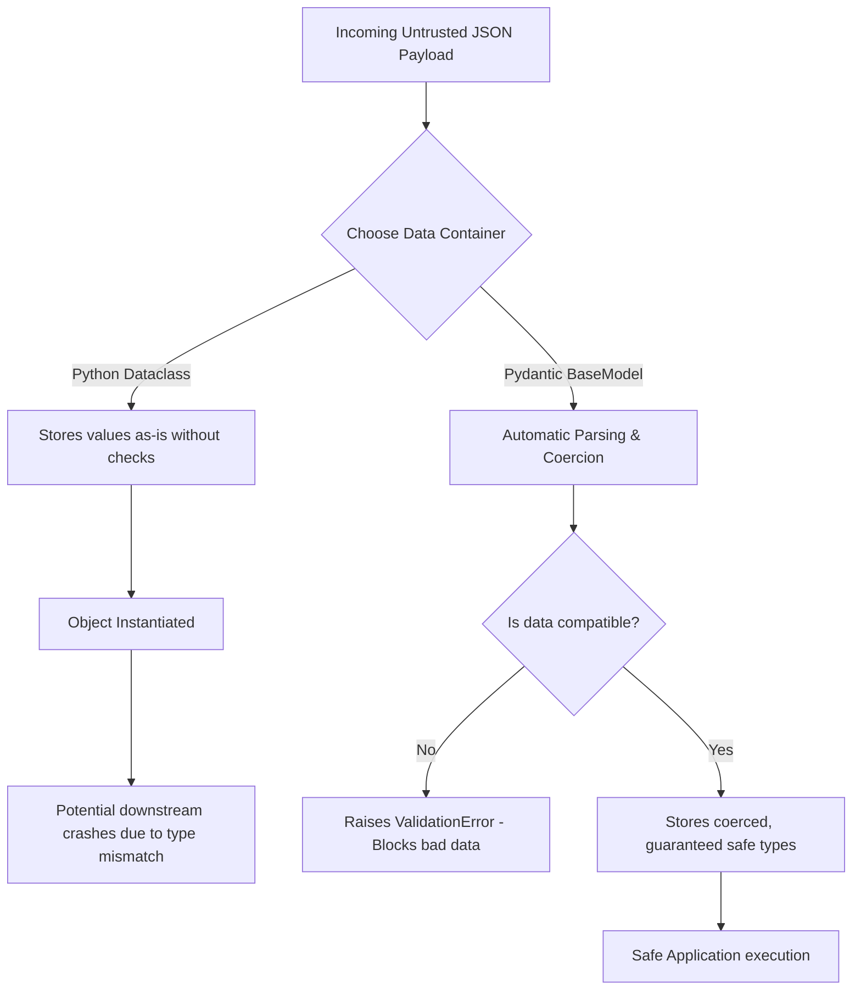

# Pydantic vs. Python Dataclasses

While both Pydantic and Python Dataclasses are used to create structured data containers in Python, they serve fundamentally different architectural purposes.

The easiest way to remember the difference is:
*   **Dataclasses** are for structuring **clean code** within your application (trusted internal boundaries).
*   **Pydantic** is for validating **untrusted data** entering your application from the outside world (APIs, JSON files, configuration files, or user inputs).

---

## 🗺️ Incoming Payload Decision Tree

The diagram below visualizes how both frameworks handle unexpected payloads arriving at your application boundary:



---

## ⚖️ 1. The Core Philosophy

### Python Dataclasses (The Blueprint)
Introduced in Python 3.7, dataclasses are built directly into the standard library. They exist to eliminate repetitive "boilerplate" code when writing classes (like writing `__init__`, `__repr__`, and `__eq__` methods manually). They focus on **storage, structure, and code cleanliness**.

### Pydantic (The Guarddog)
Pydantic is a third-party library built for **data parsing and type enforcement**. It doesn't just store data; it guarantees that the data conforms exactly to the types you specified. If the data is wrong, it raises a clear validation error.

---

## 🧠 2. The Biggest Technical Difference: Type Enforcement

Python, by default, treats type hints as optional "suggestions." Dataclasses follow this standard Python behavior, while Pydantic strictly enforces it at runtime.

### How Dataclasses handle bad data (Silent Failure)
```python
from dataclasses import dataclass

@dataclass
class UserDataclass:
    id: int
    name: str

# Passing a string instead of an int, and an int instead of a string
user = UserDataclass(id="not-an-int", name=123)
print(user) 
# Output: UserDataclass(id='not-an-int', name=123) -> No error! It allowed it.
```

### How Pydantic handles bad data (Coercion or Error)
```python
from pydantic import BaseModel, ValidationError

class UserPydantic(BaseModel):
    id: int
    name: str

# 1. Pydantic will try to "coerce" (convert) data if it is compatible:
user1 = UserPydantic(id="123", name="Alice")
print(user1.id)  # Output: 123 (It converted the string "123" to a real integer!)

# 2. If it cannot convert it, it throws an immediate error:
try:
    user2 = UserPydantic(id="not-an-int", name="Alice")
except ValidationError as e:
    print(e)  # Blocks the bad data completely and raises a ValidationError.
```

---

## 📊 3. Feature Comparison Table

| Feature | Python Dataclasses | Pydantic (BaseModel) |
| :--- | :--- | :--- |
| **Library Source** | Standard Library (Built-in) | Third-Party (`pip install pydantic`) |
| **Primary Focus** | Code cleanliness and readability | Data Validation and Type Coercion |
| **Type Enforcement** | None (Ignores type hints at runtime) | Strict (Validates or converts at runtime) |
| **JSON Serialization** | Requires custom encoders/helper code | Built-in (`model_dump_json()`) |
| **Performance** | Extremely fast (No runtime overhead) | Slightly slower due to validation (but core runs on Rust) |
| **Ecosystem Integration** | Great for general scripting, OOP | King of web frameworks (FastAPI, SQLModel, LangChain) |

---

## 🛠️ 4. Advanced Pydantic Features

Because Pydantic is designed for working with external data, it includes powerful tools that dataclasses lack out-of-the-box:

*   **Custom Validators**: You can write functions using `@field_validator` to enforce custom rules (e.g., *"Ensure the username is longer than 5 characters and contains no spaces"*).
*   **Settings Management (`BaseSettings`)**: Pydantic can automatically read your system's environment variables (`.env` files) and parse them safely into data objects for your application configuration.
*   **Complex Data Parsing**: It natively parses strings into complex types like `EmailStr`, `HttpUrl`, or `datetime` objects.

---

## 📝 Summary: Which should you choose?

*   **Use Python Dataclasses** when you are passing data **internally** from one part of your own code to another, and you trust that your internal logic is already clean. They keep your application lightweight and dependency-free.
*   **Use Pydantic** when you are dealing with an **I/O boundary**—such as receiving a payload from an API request, loading data from a database, or reading a configuration file. It ensures your core code never crashes due to unexpected data formats.
