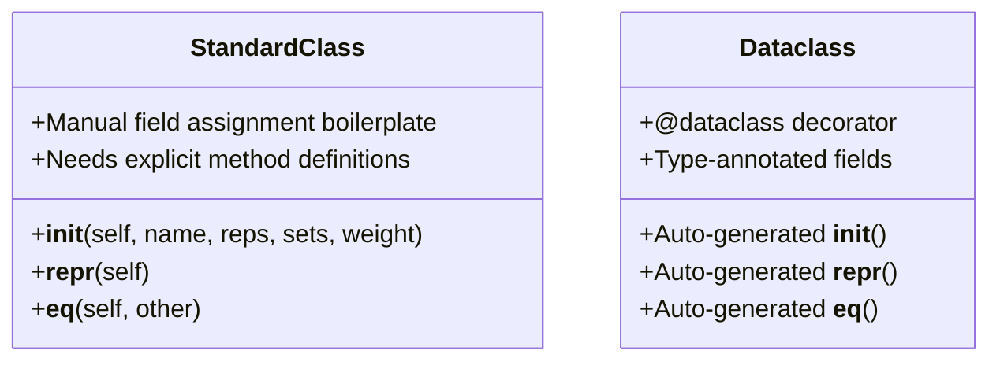

# Python Dataclasses: A Complete Guide

*Author: Bex Tuychiev (Kaggle Master & AI Writer)*

Data classes are one of those features of Python that, once you discover them, you will never want to go back to writing traditional boilerplate classes. 

This comprehensive guide covers why dataclasses are one of the best additions to Python for object-oriented programming, starting from fundamental usage to advanced, production-grade patterns.

---

## 🏗️ Structural Comparison: Standard Class vs. Dataclass

The diagram below visualizes the architectural differences between traditional class patterns and the automated `@dataclass` protocol:



---

## 💡 The Core Problem: The `__init__` Boilerplate

Consider a standard class definition in Python:

```python
class Exercise:
    def __init__(self, name, reps, sets, weight):
        self.name = name
        self.reps = reps
        self.sets = sets
        self.weight = weight
```

This class definition is highly redundant. In the `__init__` method, you are forced to repeat each parameter at least three times. For complex classes with a dozen parameters, this leads to massive boilerplate.

In comparison, the dataclass alternative is clean, type-annotated, and elegant:

```python
from dataclasses import dataclass

@dataclass
class Exercise:
    name: str
    reps: int
    sets: int
    weight: float  # Weight in lbs
```

Under the hood, the `@dataclass` decorator dynamically generates `__init__`, `__repr__`, and `__eq__` methods, reducing 20 lines of redundant boilerplate to a few simple annotations.

---

## 🗂️ 1. Basics of Python Data Classes

### 1. Automatically Generated Methods
By default, the `@dataclass` decorator automatically provides pre-configured standard dunder methods:

```python
ex1 = Exercise("Bench press", 10, 3, 52.5)

# 1. Attributes are accessible normally
print(ex1.name)  # Output: 'Bench press'

# 2. repr() returns a useful representation string instead of a memory address
print(repr(ex1))  # Output: Exercise(name='Bench press', reps=10, sets=3, weight=52.5)
```

In addition, the equality operator (`__eq__`) compares instances based on their actual data rather than their memory references:

```python
ex1 = Exercise("Bench press", 10, 3, 52.5)
ex2 = Exercise("Bench press", 10, 3, 52.5)

print(ex1 == ex2)  # Output: True
print(ex1 == ex1)  # Output: True
```

### 2. Type Hints: Required but Not Enforced
Dataclasses require Python type annotations. Any valid Python type (including `typing.Any` or custom structures) can be declared:

```python
from typing import Any
from dataclasses import dataclass

@dataclass
class Dummy:
    attr: Any
```

> [!WARNING]
> **No Runtime Type Enforcement**: Despite type annotations being required by the syntax, Python's dynamic interpreter **does not enforce** these types at runtime.

```python
# This runs without errors despite completely incorrect types!
silly_exercise = Exercise("Bench press", "ten", "three sets", 52.5)
print(silly_exercise.sets)  # Output: "three sets"
```
*If strict runtime verification is necessary, you should integrate type checkers like **Mypy** or use libraries like **Pydantic**.*

### 3. Default Values & The `field()` Function
You can specify default values directly using standard parameter assignments:

```python
@dataclass
class Exercise:
    name: str = "Push-ups"
    reps: int = 10
    sets: int = 3
    weight: float = 0
```

> [!CAUTION]
> **Field Order Rule**: In Python dataclasses, fields without default values **cannot** follow fields with default values.

```python
# 🚫 NOT ALLOWED - Throws TypeError: non-default argument 'weight' follows default argument
@dataclass
class Exercise:
    name: str = "Push-ups"
    weight: float 
```

To gain finer control over field behavior (such as excluding a field from the `__repr__` output or comparison evaluations), use the `field()` function:

```python
from dataclasses import dataclass, field

@dataclass
class Exercise:
    name: str = field(default="Push-up")
    reps: int = field(default=10)
    sets: int = field(default=3)
    weight: float = field(default=0)
```

### 4. Dynamic Class Generation via `make_dataclass`
You can also generate dataclasses dynamically at runtime:

```python
from dataclasses import make_dataclass

Exercise = make_dataclass(
    "Exercise",
    [
        ("name", str),
        ("reps", int),
        ("sets", int),
        ("weight", float),
    ],
)
```
*Note: This sacrifices readability in static code analysis, so standard class syntax is preferred.*

---

## ⚙️ 2. Advanced Data Class Patterns

### 1. Default Factories for Mutable Collections
When defining fields containing mutable collections (like lists, dictionaries, or sets), you cannot set a direct default value (e.g., `exercises: list = []`), as this shares the same mutable reference across all instances. Dataclasses protect against this error by raising a `ValueError`.

The correct solution is to use the `default_factory` parameter:

```python
from typing import List
from dataclasses import dataclass, field

@dataclass
class WorkoutSession:
    # default_factory ensures a new list instance is created for every new WorkoutSession
    exercises: List[Exercise] = field(default_factory=list)
    duration_minutes: int = 0
```

`default_factory` accepts any callable function. You can even pass custom factory functions to pre-load default parameters:

```python
def create_warmup():
    return [
        Exercise("Jumping jacks", 30, 1),
        Exercise("Squat lunges", 10, 2),
        Exercise("High jumps", 20, 1),
    ]

@dataclass
class WorkoutSession:
    exercises: List[Exercise] = field(default_factory=create_warmup)
    duration_minutes: int = 5
```

### 2. Custom Methods & Formatting (`__str__`)
Since dataclasses are regular classes, you can add custom methods and override existing ones like `__str__` to control how the object prints:

```python
@dataclass
class Exercise:
    name: str = "Push-ups"
    reps: int = 10
    sets: int = 3
    weight: float = 0

    def __str__(self):
        base = f"{self.name}: {self.reps}/{self.sets}"
        if self.weight == 0:
            return base
        return base + f", {self.weight} lbs"
```

Now, calling `print(exercise_instance)` yields a clean, customized string instead of the verbose default representation:

```python
ex1 = Exercise("Burpees", 15, 3)
print(ex1)  # Output: Burpees: 15/3
```

---

### 3. Object Comparison and Ordering
By default, dataclasses do not support comparison operators (`>`, `<`, etc.). You can easily enable mathematical sorting by setting `order=True` in the decorator parameters:

```python
@dataclass(order=True)
class WorkoutSession:
    exercises: List[Exercise] = field(default_factory=create_warmup)
    duration_minutes: int = 5
```

#### How Sorting Order is Evaluated
Comparison is performed field-by-field in the exact order they are declared in the class. If you want to sort by a specific field (like `duration_minutes`) while ignoring other fields (like a list of exercises or a date string), set `compare=False` on the non-comparable fields:

```python
@dataclass(order=True)
class WorkoutSession:
    # Exclude from sorting evaluation
    date: str = field(default=None, compare=False)
    exercises: List[Exercise] = field(default_factory=create_warmup, compare=False)
    
    # First evaluated field for sorting
    duration_minutes: int = 5
```

---

### 4. Post-Initialization Manipulation (`__post_init__`)
When a field's value depends on the inputs of other fields, use the `__post_init__` method. By setting `init=False` on the target field, you delay its assignment until the base fields are fully initialized:

```python
@dataclass
class WorkoutSession:
    exercises: List[Exercise] = field(default_factory=create_warmup)
    duration_minutes: int = field(default=0, init=False)

    def __post_init__(self):
        set_duration = 3
        # Dynamically calculate total duration based on the sets of all input exercises
        for ex in self.exercises:
            self.duration_minutes += ex.sets * set_duration
```

---

### 5. Immutability & Safe Protection (`frozen=True`)
To protect your objects from accidental deletion or mutation after instantiation, make them read-only by setting `frozen=True`:

```python
@dataclass(frozen=True)
class FrozenExercise:
    name: str
    reps: int
    sets: int
    weight: float = 0

ex1 = FrozenExercise("Muscle-ups", 5, 3)

# Any attempt to reassign or add properties raises a FrozenInstanceError
# ex1.sets = 5  -> Raises FrozenInstanceError
```

> [!IMPORTANT]
> **Shallow Immutability Warning**: Setting `frozen=True` only creates *shallow* immutability. If a field contains a mutable object (like a `List`), the container reference itself cannot be reassigned, but the items *inside* that collection can still be modified. To achieve true immutability, ensure your mutable collections are stored as immutable equivalents like `tuples`.

---

### 6. Inheritance in Dataclasses
Inheritance works seamlessly with dataclasses. However, you must respect the field placement rules:

```python
@dataclass(frozen=True)
class WorkoutSession:
    exercises: List[Exercise] = field(default_factory=create_warmup)
    duration_minutes: int = 5

@dataclass(frozen=True)
class CardioWorkoutSession(WorkoutSession):
    # Child class inherited fields
    pass
```

> [!WARNING]
> If a parent class defines any field with a default value, **all subsequent fields in the child class must also define default values**. 

```python
# 🚫 NOT ALLOWED - Throws TypeError: non-default argument 'intensity_level' follows default argument
@dataclass(frozen=True)
class CardioWorkoutSession(WorkoutSession):
    intensity_level: str
```

---

## ⚖️ Disadvantages of Data Classes

While dataclasses cover most data collection use cases, they might not be optimal in the following architectural scenarios:
*   **Highly Custom `__init__` / `__new__` Methods**: If your instantiation pipeline requires complex preconditions or custom parameter parsing.
*   **Complex Polymorphic Relationships**: Deep class hierarchies can suffer from strict field-placement rules (e.g., mixing non-default parent fields with child fields).
*   **Lack of Schema Enforcement**: Dataclasses do not enforce types at runtime, making them brittle at untrusted boundaries without third-party frameworks. Refer to **PEP 557** for the complete design rationale.

---

## 🏆 Learning & Reference Resources

*   [PEP 557 — Data Classes](https://peps.python.org/pep-0557/) — The official Python Enhancement Proposal introducing dataclasses.
*   *Object-Oriented Programming in Python* — Develop core OOP design foundations.
*   *Data Types for Data Science* — Explore companion standard data structures like `namedtuples`, `defaultdicts`, and `counters`.
