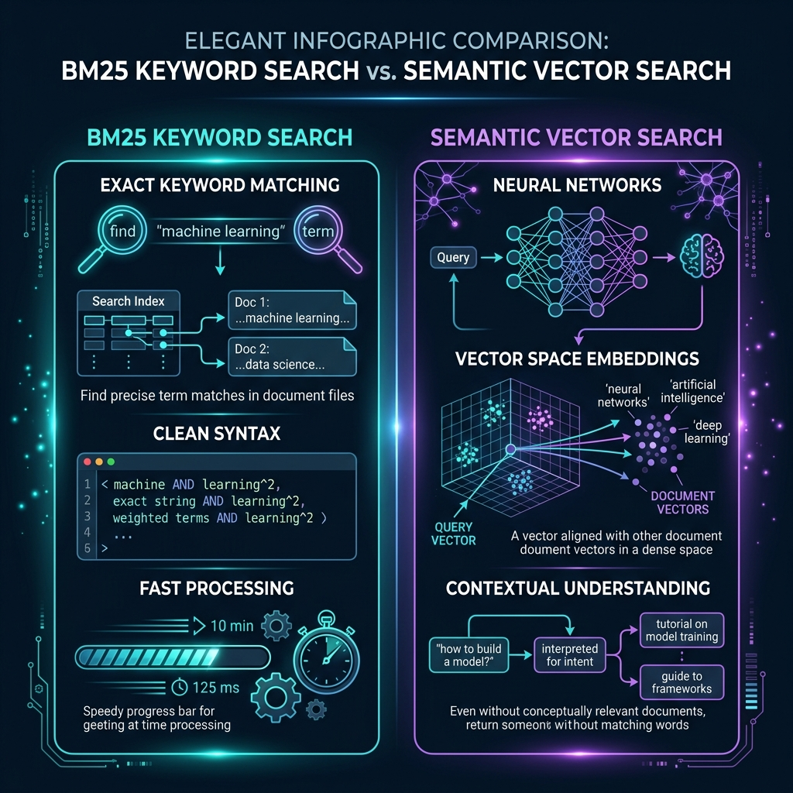

# BM25 Explained: The Classic Algorithm that Still Powers Search Today

*Written by Zawanah | Oct 3, 2025*

Before today’s AI-driven world of semantic search and embeddings, search engines had to rely on something much simpler: keywords.

And yet, even back then, search could feel surprisingly smart. I can type *“best restaurants near Clementi”* and instantly get pages that look highly relevant — without a single neural network involved.

The secret behind that “smarts” is an algorithm called **BM25**.

Born in the 1990s, it’s a ranking function that evaluates how well documents match your query based on keyword frequency, rarity, and document length.

Despite being decades old, BM25 hasn’t gone away. BM25 remains popular due to its speed, transparency, robust results, and ease of implementation. Many current search frameworks let users mix BM25 with neural and embedding-based methods for improved search accuracy and relevance.

In this article, we’ll break down what BM25 is, how it works (without drowning you in math), and why it remains a critical part of modern search — even in the age of embeddings.

---

## What Is BM25?

At its core, BM25 is a ranking algorithm for keyword-based search. When you type in a query like *"wireless noise-cancelling headphones"*, the search engine has to decide which listings to show you first.

BM25 does this by scoring documents (in this case, product listings) based on three main factors:

### 1. Term Frequency (TF)
*How many times does the keyword appear in the product listing?*
* **Product A**: Mentions “noise-cancelling” 5 times in the title, features, reviews.
* **Product B**: Mentions “noise-cancelling” once at the bottom of the description.

BM25 gives **Product A** a higher score because repeated mentions suggest the feature is central to the item, not an afterthought.

### 2. Inverse Document Frequency (IDF)
*How rare is the keyword across all documents?*
If nearly every product listing mentions “wireless,” that word carries less weight than “noise-cancelling,” which might appear in fewer product listings.
* Keyword **“wireless”** appears in 80% of headphones listings (too common, low IDF weight).
* Keyword **“noise-cancelling”** appears in only 20% of listings (rarer, high IDF weight).

BM25 assigns more weight to “noise-cancelling” since it helps separate relevant products from the crowd.

### 3. Document Length Normalization
*Shorter descriptions that match your query are often more relevant than overly long ones stuffed with keywords.*
* **Product C**: Short, focused description — *“Wireless Noise-Cancelling Headphones with 20h battery life”*.
* **Product D**: Long description stuffed with generic marketing terms — *“Experience amazing sound quality, top comfort, perfect for fitness, gaming, travel, office use, lifestyle upgrade, and more. Features include Bluetooth 5.0, ergonomic design, and basic noise-cancelling technology.”* with only one small mention of “noise-cancelling.”

Although both contain the keywords, BM25 ranks **Product C** higher, because shorter, focused descriptions are usually more relevant.

---

## BM25 vs Semantic Search

How does BM25 compare to semantic search?

*BM25 compared with Semantic Search. Infographic generated to visualize the comparison.*

* **BM25 is keyword-based**: It ranks results by how often your exact words appear, how rare those words are, and how focused the document is. It’s fast, lightweight, and easy to interpret. If you search Shopee for *“wireless noise-cancelling headphones”*, BM25 ensures listings with those exact terms rise to the top.
* **Semantic Search is meaning-based**: Instead of only matching words, it uses vector embeddings to capture context and intent. For example, if you search for *“headphones to block background noise”*, semantic search can still find *“noise-cancelling headphones”* — even though you didn’t use the exact phrase.

Neither approach is perfect on its own. That’s why modern search systems often combine both.

---

## Why BM25 Still Matters Amidst Semantic Search

Why even care about BM25? Isn’t it outdated? Not at all.

BM25 still powers a huge portion of keyword-based search engines today because it’s fast, simple, and effective for exact word matching. When the query is very obvious — like typing *“wireless noise-cancelling headphones”* — BM25 shines.

It doesn’t need deep learning to understand embeddings; it just needs to rank results based on the keywords you typed, how rare they are, and how focused the document is.

For smaller datasets or applications where keywords matter more than context — such as internal knowledge bases, FAQ lookups, or product catalogs — BM25 can outperform more complex AI systems. It’s also much easier and cheaper to implement, which makes it a practical choice for many real-world systems.

Simply put, BM25 is the reliable workhorse of search. While Approximate Nearest Neighbor (ANN) and semantic methods are great at capturing meaning, BM25 ensures that when you say “noise-cancelling,” you actually get products with noise-cancelling — not just “great sound quality.”

---

## Conclusion

BM25 and semantic search are tools built for different strengths:
* **BM25** guarantees exact keyword precision.
* **Semantic search** unlocks context and meaning.

The choice comes down to what matters most for your use case. If you’re running a small product catalog or FAQ system, BM25 might be all you need. But if you’re building production-scale apps like search engines, chatbots, or recommendation systems, semantic search — often powered by ANN — becomes essential.

In practice, the most powerful systems don’t choose one or the other. **They go hybrid**, using BM25 to ground the results in exact matches while semantic search fills in the gaps for synonyms and context. That’s why platforms like Elasticsearch, Vespa, and Weaviate lean on both.

> "BM25 guarantees correctness, semantic search guarantees understanding — the best results often come when you combine them."

### References
1. *“BM25: How it works and why is it so effective”*, Elastic Blog, 2024
2. *“BM25 vs. neural embeddings in modern search”*, Search Engine Land, 2024
