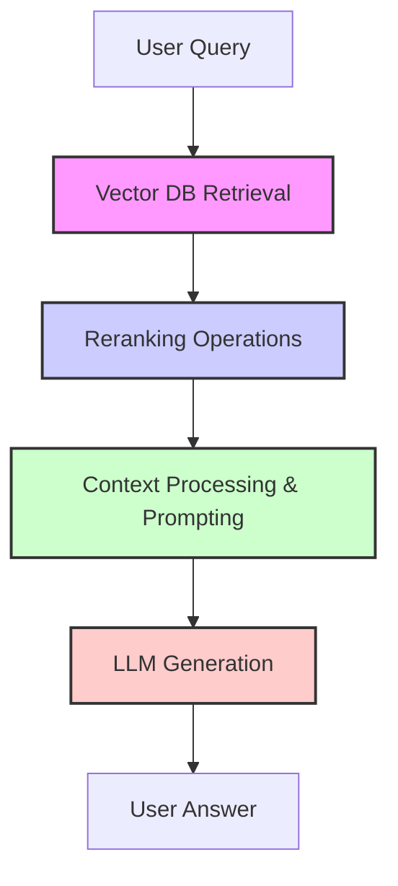
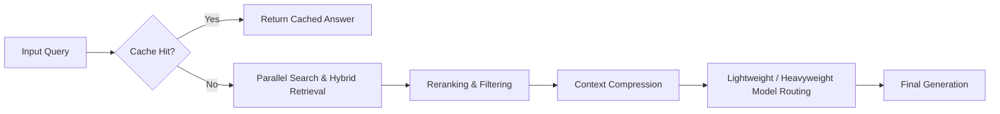

# 7 Techniques to Reduce Latency in RAG Systems: Building Faster Retrieval Pipelines

*Author: Nishanth P (AI Engineer @Tenarai)*

---

## Introduction: The Hidden Problem in RAG Systems 🔍

Most RAG (Retrieval-Augmented Generation) systems do not fail because of the Large Language Model (LLM) itself. Instead, they fail because the retrieval pipeline is too slow. 

A slow RAG system frustrates users, kills adoption, inflates computing costs, and wastes valuable resources. Speed in a production-grade RAG pipeline is not an accident—it must be intentionally engineered.

For example, when a user queries: *"Compare ELSS and PPF tax benefits"*, a slow system might take several seconds to respond, which degrades the user experience.

---

## Understanding Latency in RAG ⏱️

Latency is the total time your RAG system takes to answer a query. It is a cumulative metric composed of several distinct bottlenecks:

* **Vector Database Retrieval Time**: Scanning vector indexes to find matching candidate chunks.
* **Reranking Operations**: Scoring and sorting candidate chunks using computationally intensive models.
* **Context Processing Overhead**: Cleaning, organizing, and formatting tokens before sending them to the LLM.
* **LLM Generation Time**: Time taken by the LLM to process the prompt and generate tokens (Time to First Token + token generation speed).

**Lower Latency = Smoother User Experience (UX) + Higher Throughput + Reduced Operational Costs**

---

## 7 Techniques to Reduce Latency

Here are seven battle-tested techniques to optimize your RAG pipeline's speed.

---

### 1. Vector Database Optimization 🗄️

Vector database optimization focuses on how embeddings are stored, indexed, and retrieved to minimize physical search time. This is typically the first bottleneck to analyze in a RAG pipeline.

#### How to Implement 🛠️
* **Approximate Nearest Neighbor (ANN) Algorithms**: Replace exhaustive exact k-NN searches with faster index types such as HNSW (Hierarchical Navigable Small World) or IVF (Inverted File Index). These algorithms trade off a tiny amount of retrieval accuracy for massive speed gains.
* **Match Indexing to Data Scale**: Do not over-engineer indexing. A 10,000-document knowledge base requires a different optimization strategy than a 10-million document corpus.
* **Optimize Embedding Dimensions**: Consider dimensionality reduction techniques like Principal Component Analysis (PCA) when appropriate. Lower-dimensional vectors lead to faster similarity calculations.
* **Vector Quantization (Scalar/Product Quantization)**: Compress vector values from floating points (e.g., Float32) to lower precisions (e.g., Int8). Quantization reduces memory footprint and speeds up similarity scoring.

#### When to Use ✓
* When vector retrieval time exceeds **200ms**.
* For large-scale knowledge bases (**10,000+ documents**).
* In high-throughput systems serving concurrent requests.
* When hardware memory constraints are a factor.

> [!TIP]
> **Key Insight**: Vector database optimization is the first line of defense against slow retrieval. Always start here when baseline queries are slow.

---

### 2. Caching Strategies 💾

Caching stores precomputed resources and results, eliminating redundant computation and retrieval operations. It is one of the highest-impact, lowest-effort optimizations available.

#### How to Implement 🛠️
* **Query Caching (Semantic Cache)**: Store complete generated answers for identical or semantically similar queries. When a new query maps closely to an old one, serve the cached answer immediately.
* **Embedding Caching**: Cache computed embeddings for common queries to avoid invoking the embedding model repeatedly.
* **Context Caching**: Cache retrieved context chunks for popular search topics. If multiple queries request information from the same popular document, load it from the cache.
* **Multi-Level Caching**: Design a tiered caching architecture:
  * *L1 (In-Memory)*: Fastest access for hot queries.
  * *L2 (Distributed Cache - e.g., Redis)*: Shares cache across different application instances.
  * *L3 (Disk Cache)*: For large, less frequent lookup tables.

#### When to Use ✓
* Systems with repetitive or predictable query patterns (e.g., customer support, FAQs).
* Multi-user setups with highly overlapping informational needs.
* When database and LLM API cost reduction is a priority.

> [!NOTE]
> **Key Insight**: A well-designed caching layer can bypass the entire vector database and LLM pipeline for **60% to 80%** of customer queries in typical production scenarios.

---

### 3. Reranking Optimization 🎯

Reranking narrows down retrieved documents to the most relevant subset before forwarding them to the LLM. Doing this efficiently ensures quality without causing a massive latency spike.

#### How to Implement 🛠️
* **Two-Stage Retrieval**: Perform a fast, cheap initial retrieval returning a larger number of candidates ($k \approx 50$), followed by a precise, expensive reranking step returning a smaller number of chunks ($k \approx 5\text{ to }10$).
* **Lightweight Reranker Models**: Choose smaller cross-encoder architectures or optimized sequence classification models rather than massive LLMs for scoring.
* **Score-Based Filtering (Early Exit)**: Set relevance thresholds. If the initial retrieval yields chunks with high confidence scores, skip the reranker stage entirely and pass them forward.
* **Hybrid Search**: Combine vector search with traditional keyword search (like BM25) to raise retrieval quality at the first stage, reducing the workload of the second-stage reranker.

#### When to Use ✓
* When initial retrieval contains too many irrelevant or noisy chunks.
* To improve precision without blowing up generation latency.
* When the LLM context window is limited, necessitating highly dense information chunks.

> [!TIP]
> **Key Insight**: Optimizing your reranking step ensures you feed the LLM **5 perfect chunks** instead of **20 mediocre ones**, saving downstream generation time.

---

### 4. Context Window & Prompt Optimization 📝

Fine-tuning context length and prompt construction reduces the overall token count, directly accelerating LLM inference times.

#### How to Implement 🛠️
* **Dynamic $k$**: Adjust the number of chunks retrieved based on query complexity. Simple factual questions need fewer context chunks ($k=2$), while complex analytical queries receive more ($k=5+$).
* **Smaller Chunk Sizes**: Use smaller base chunk sizes (e.g., 256–512 tokens) to speed up both retrieval and generation.
* **Context Compression**: Use summarization, factual distillation, or information extraction to compress retrieved text. Send only key sentences rather than full paragraphs.
* **Relevance Filtering**: Set a strict similarity threshold to exclude low-scoring chunks. 
* **Prompt Tightening**: Remove fluff, verbose instructions, and redundant sentences from system prompts. Every token counts toward TTFT (Time to First Token).
* **Template Optimization**: Keep prompt templates standardized and concise.

#### When to Use ✓
* When LLM generation and network processing dominate your overall latency profile.
* When the retrieved text is highly repetitive or noisy.
* When lowering LLM API consumption cost is a priority.

> [!NOTE]
> **Key Insight**: Reducing the size of your prompts and contexts offers the highest cost-to-performance ROI of any optimization technique.

---

### 5. Model Selection & Optimization 🎛️

Selecting and configuring appropriate models for embeddings and text generation balances response speed and semantic accuracy.

#### How to Implement 🛠️
* **Smaller Embedding Models**: Use highly optimized, smaller embedding models (e.g., `all-MiniLM-L6-v2` with 384 dimensions) rather than massive models, unless fine-grained semantic nuances are lost.
* **Smarter Model Routing**: Classify query complexity. Direct simple queries to fast, lightweight models (e.g., GPT-3.5-Turbo or Claude Haiku), and reserve expensive models (e.g., GPT-4 or Claude Opus) for complex reasoning.
* **Model Quantization**: If hosting models locally, run quantized versions (e.g., 4-bit or 8-bit weights). This reduces VRAM requirements and accelerates token generation.

#### When to Use ✓
* When LLM generation is the primary latency driver.
* When minor quality trade-offs are acceptable for conversational flows.
* When hosting open-weights models on limited local hardware.

> [!TIP]
> **Key Insight**: Not all queries require an expensive reasoning engine. Routing queries to the right model size reduces both latency and cost.

---

### 6. Parallel Processing ⚡

Parallel processing runs independent tasks concurrently to shave seconds off the overall pipeline execution time.

#### How to Implement 🛠️
* **Parallel Retrieval**: Query multiple vector stores, index shards, or external databases concurrently instead of sequentially.
* **Concurrent Embedding Generation**: Process queries or documents in parallel batches.
* **Asynchronous Operations**: Design the pipeline using async/await patterns. Network requests, database calls, and file system I/O should never block the main thread.
* **Batch Processing**: Group vector and database lookups to run in single multi-row queries.

#### When to Use ✓
* When pulling context from multiple heterogeneous sources.
* In sharded databases or distributed data sources.
* When the hardware has multi-core CPUs and GPUs capable of parallel computation.

> [!IMPORTANT]
> **Key Insight**: Parallel processing transforms a slow, sequential pipeline into a highly efficient concurrent system.

---

### 7. Smart Routing & Query Classification 🧭

Smart routing inspects the incoming query first, dynamically directing it through the most optimized pathway.

#### How to Implement 🛠️
* **Intent Classification**: Classify the query intent (e.g., conversational, factual, analytical).
* **Complexity Scoring**: Fast-track simple queries through a minimal pipeline (e.g., cache check -> direct generation), and only trigger full retrieval for complex queries.
* **Domain Routing**: Route queries to specialized sub-indexes. If a query is about *finance*, search only the finance-related collections rather than the entire enterprise database.
* **Cache-First Routing**: Check the caching layers before executing any embedding generation or retrieval steps.

#### When to Use ✓
* Multi-domain databases containing diverse datasets.
* Applications handling varying user query types (from greetings to complex analytical requests).
* To optimize resource allocation across massive enterprise pipelines.

---

## The Engineering Mindset: Putting It All Together 🧩

Fast RAG is not about implementing a single tool and hoping for the best. It requires thinking holistically about the pipeline stages:

### Real-World Impact 📈
Implementing these optimization techniques yields substantial performance improvements:
* **Latency Reduction**: 3x to 5x faster overall response times.
* **Cost Savings**: 40% to 60% reduction in API token costs.
* **Scalability**: Support for up to 10x higher concurrent user queries.

---

## Implementation Priority Guide: Where to Start 🚀

If your RAG pipeline is experiencing latency issues, follow this prioritized roadmap:

| Priority | Technique | Ease of Implementation | Latency Impact |
| :--- | :--- | :--- | :--- |
| **1** | **Caching Strategies** | Easy | Extremely High (60-80% bypass) |
| **2** | **Vector DB Optimization** | Medium | High (sub-50ms searches) |
| **3** | **Context & Prompt Optimization**| Easy | High (reduces TTFT and cost) |
| **4** | **Smart Routing & Classification**| Medium | Medium (avoids overprocessing) |
| **5** | **Parallel Processing** | Medium | Medium (removes sync blocking) |
| **6** | **Model Selection & Routing** | Hard | High (balances speed & intelligence) |
| **7** | **Reranking Optimization** | Hard | Medium (trims redundant chunks) |

---

## Key Takeaways ⭐

* **Speed is engineered**, not accidental.
* **Measure everything**: You cannot optimize what you do not profile. Track Latency-per-Stage.
* **Start simple**: Focus on high-impact, low-effort changes like caching and context size optimization first.
* **Compounding returns**: Optimizations compound when they are applied across the entire retrieval and generation chain.
