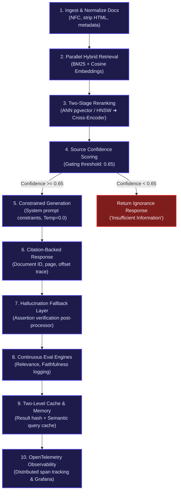
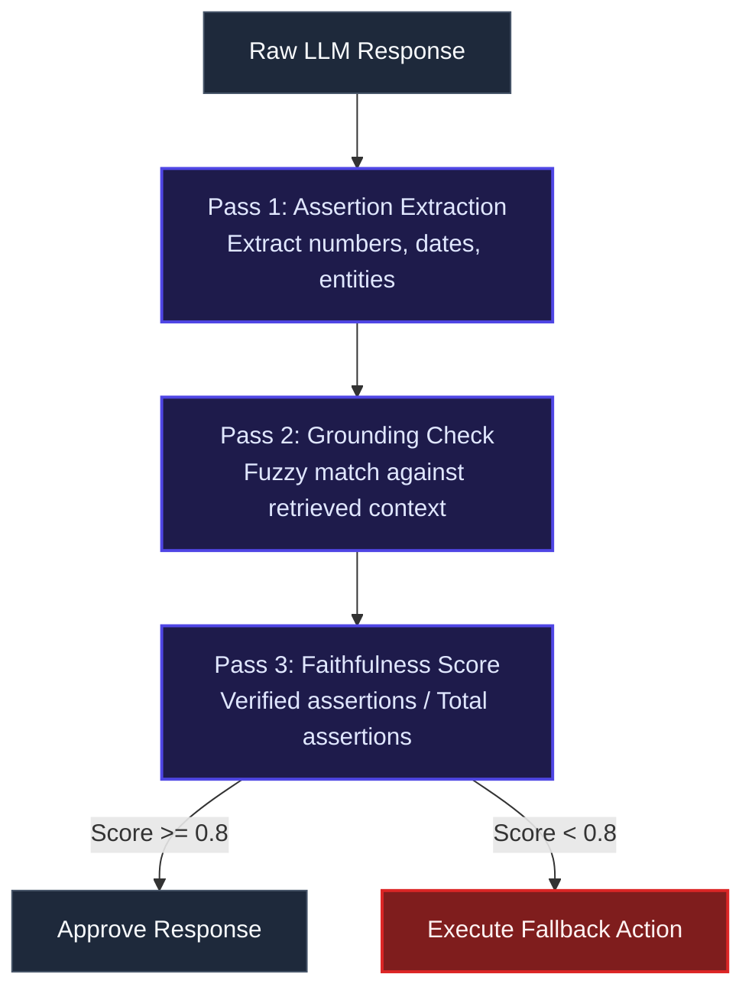

# How to Design a RAG Pipeline for 10 Million Documents with Zero Hallucination

Retrieval-Augmented Generation (RAG) at scale is one of the most demanding engineering challenges in production AI today. The gap between a working prototype and a system that reliably handles millions of documents without hallucinating is not a small one—it spans architecture, infrastructure, evaluation, and operational discipline.

When teams set out to build RAG systems for enterprise search, internal knowledge bases, legal document analysis, healthcare records, or large-scale customer support platforms, they quickly discover that the naive approach—*“grab some embeddings, do a similarity search, pass chunks to an LLM”*—breaks down fast. It works at 1,000 documents. It does not work at 1 million. And it is entirely unsuitable at 10 million.

The reasons are specific, predictable engineering problems: **retrieval latency, index maintenance cost, precision degradation at scale, hallucinations that compound through the generation step, lack of verifiability, and no way to know when the system is silently failing.**

---

## 📐 Why 10 Million Documents Changes Everything

At 1,000 documents, you can brute-force anything. You can vector scan every chunk, prompt the model with all of it, and call it a day. At **10 million documents**, everything breaks:
*   **Vector search scaling bottleneck**: Brute-force vector similarity scans take minutes, not milliseconds.
*   **Context window limits**: A single frontier model call cannot see even $0.001\%$ of your total corpus.
*   **Poisoned generation**: A bad retrieval step poisons everything downstream. The best model in the world cannot un-hallucinate a wrong chunk.
*   **Compounding hallucinations**: One wrong retrieved fact leads the model to generate plausible-sounding extensions of that fact.

At scale, **retrieval quality matters more than the LLM itself**. A perfectly retrieved set of 5 chunks passed to a lightweight model will outperform a hallucinating frontier model built on bad retrieval every single time.

---

## 🛠️ The 10-Step Production Architecture



---

### 📥 Step 01: Ingest & Normalize Documents

Before any retrieval can work, your data has to be clean, normalized, and consistent. At a 10M document scale, files originate from scattered environments (PDFs, Word files, HTML pages, scanned images, Markdown files, internal wikis), each with distinct encodings, noise patterns, and structures.

#### Action Plan
1.  **Unicode Normalization**: Apply NFC normalization to ensure character bytes are identical (e.g., ensuring `é` is represented consistently).
2.  **Formatting Purge**: Strip formatting artifacts (HTML tags, PDF control characters, footer/footnote markers).
3.  **Whitespace Standardization**: Standardize whitespace, newlines, and strip non-printable characters.
4.  **Metadata Tagging**: Enforce strict metadata schema tagging at ingest (source, timestamp, author, domain, version, locale).

> [!IMPORTANT]
> A chunk containing a non-breaking space (e.g. `"Vishal\u00a0Mysore"`) will never match a search for `"Vishal Mysore"` using regular spaces. These silent failures destroy recall and are extremely difficult to debug unless normalization is enforced at the ingestion boundary.

**At 10M scale**: Deploy a distributed ingestion pipeline using **Apache Kafka** paired with **Apache Spark** or **Flink** for parallel, idempotent processing. Generate a content hash for every document—re-ingestion becomes a cheap `no-op` if the hash has not changed.

---

### 🔍 Step 02: Hybrid Retrieval (BM25 + Vector Embeddings)

Using only vector embeddings is a common production mistake. Embeddings excel at capturing general semantics but have a major failure mode: **exact keyword and identifier matching**. 

If a user asks *“What did Clause 4.2.1 of the NDA say about termination?”*, a semantic embedding model will return chunks generally talking about termination, whereas **BM25** will pin down the exact Clause 4.2.1 reference.

#### The Mathematical Engine

*   **BM25 (Okapi BM25)**:
    $$\text{Score}(Q, D) = \sum_{i=1}^{n} \text{IDF}(q_i) \cdot \frac{f(q_i, D) \cdot (k_1 + 1)}{f(q_i, D) + k_1 \cdot \left(1 - b + b \cdot \frac{|D|}{\text{avgdl}}\right)}$$
    *   $k_1 = 1.2$: Governs term frequency saturation.
    *   $b = 0.75$: Controls document length normalization.
    *   $\text{IDF}$ rewards rare terms and penalizes highly common ones.

*   **Vector Cosine Similarity**:
    Using models like `all-MiniLM-L6-v2` for speed (384 dimensions) or `text-embedding-3-large` (1536+ dimensions) for high accuracy, similarity is calculated using the dot product on L2-normalized vectors:
    $$\text{Similarity}_{\text{cosine}}(A, B) = \frac{A \cdot B}{\|A\| \|B\|}$$

*   **Hybrid Fusion Score**:
    $$\text{Fused Score} = \alpha \cdot \text{Similarity}_{\text{cosine}} + (1 - \alpha) \cdot \text{Score}_{\text{normalized BM25}}$$
    *   $\alpha$ is tunable per domain. For legal documents, lean on BM25 ($\alpha = 0.3$). For conceptual knowledge bases, lean on vector embeddings ($\alpha = 0.7$).

In production, run both retrieval paths in parallel. Retrieve the top 30 candidates from each, union them, calculate fused scores, and pass the top 15-30 candidates to the reranker.

---

### ⚡ Step 03: Two-Stage Reranking (ANN + Cross-Encoder)

#### Stage 1: Approximate Nearest Neighbor (ANN)
Doing exact cosine similarity over 10M high-dimensional vectors in real time is computationally prohibitive. ANN indices trade a fraction of recall for microsecond search latencies:
*   **HNSW (Hierarchical Navigable Small World)**: Best recall/speed tradeoff. Used in Pinecone, Weaviate, Milvus, pgvector.
*   **IVF-PQ (Inverted File + Product Quantization)**: Significantly reduces memory footprint by compressing vectors (FAISS).
*   **ScaNN**: Extremely fast throughput at massive scale.

At 10M scale, HNSW retrieves the top 100 candidates in $\approx 10\text{ms}$ with $>95\%$ recall@10 compared to an exact search.

#### Stage 2: Cross-Encoder Reranking
While the first stage is fast, it is imprecise because bi-encoders embed the query and document chunk independently. A **Cross-Encoder** feeds both the query and the chunk into the network together, capturing deep attention interactions:

$$\text{CrossEncoder}([Q, C]) \rightarrow \text{Relevance Score} \in [0, 1]$$

*   **Models**: `ms-marco-MiniLM-L-6-v2` (90MB, fast) or `ms-marco-MiniLM-L-12-v2` (more accurate).

**Why it matters**: A bi-encoder might rank an essential chunk at position #17. A cross-encoder reads the exact query text against the chunk's content and elevates it to position #1. Reranking only runs on the top 15-30 candidates from Stage 1—never the entire corpus.

---

### 🛡️ Step 04: Source Confidence Scoring

Every retrieved chunk must carry a composite confidence score before it is allowed to enter the LLM prompt context. This score acts as your first line of defense against hallucinations.

$$\text{Confidence} = 0.5 \cdot \text{Score}_{\text{retrieval}} + 0.2 \cdot \text{Score}_{\text{freshness}} + 0.2 \cdot \text{Score}_{\text{authority}} + 0.1 \cdot \text{Score}_{\text{agreement}}$$

1.  **Retrieval Score**: Normalized cross-encoder score from Step 3 ($0 \rightarrow 1$).
2.  **Freshness Score**: Decays score for older documents (e.g., documents older than 2 years receive a decay penalty).
3.  **Authority Score**: Domain-specific weight (e.g., internal audited documentation receives a higher weight than external scraped wikis).
4.  **Agreement Score**: Increases when multiple retrieved chunks independently state the same facts.

> [!WARNING]
> **Threshold Gating**: If the final composite confidence score is $< 0.65$ for all retrieved chunks, **halt the pipeline**. Return *"Insufficient information found in the knowledge base."* A confident wrong answer is infinitely worse than an honest *"I do not know."*

---

### 📝 Step 05: Constrained Generation

You must explicitly program the LLM to act under tight contextual constraints.

```yaml
System Prompt: |
  You are a citation-backed AI assistant. Answer using ONLY the provided Context sections below.
  
  Strict Rules:
  1. Every claim you make must be directly supported by the provided Context.
  2. Cite every assertion with [Source N] where N is the context section number.
  3. If the Context does not contain the answer, respond with exactly:
     "The provided documents do not contain sufficient information to answer this question."
  4. Do NOT use any knowledge from your pre-training data to fill gaps.
  5. Do NOT speculate, extrapolate, or make inferences beyond what the Context explicitly states.
  
  Context:
  ---
  [Source 1: NDA_Agreement.pdf, Page 4]
  <chunk text>
  ---
  [Source 2: Employee_Policy_v3.docx, Page 12]
  <chunk text>
```

#### Hyperparameter Configuration
*   **Temperature**: Set strictly to `0.0` or `0.1`. Higher temperatures increase token diversity and lead directly to hallucinations.

---

### 🏷️ Step 06: Citation-Backed Responses

Every claim must be fully auditable and traceable to its source document, including page numbers and character offsets.

#### Citation Example
> "The employee joined the company in 2019 **[Source 1]** and led the cloud migration initiative **[Source 3]**, which reduced overall infrastructure costs by 40% **[Source 1, Source 2]**."

#### Metadata Stored per Citation Trace
*   The exact character bounds and raw text of the chunk.
*   Source Document ID, hash, and version.
*   Page numbers, sheet names, or URI paths.
*   Timestamp of the document (verifying it was the latest at query time).

This granular traceability enables compliance teams to verify outputs and forms an active feedback loop: if a user flags a claim, you know exactly which chunk to investigate and adjust.

---

### 🚨 Step 07: Hallucination Fallback Layer (Post-Processor)

Even with constrained prompts, edge-case hallucinations can occur. Run a three-pass asynchronous post-verification processor before releasing the response to the user:



#### Post-Verification Passes
1.  **Assertion Extraction**: Parse the generated response for factual claims, numbers, proper nouns, and dates using regular expressions or named entity recognition (NER).
2.  **Grounding Check**: Perform fuzzy string matching on every extracted claim against the raw retrieved chunks.
3.  **Faithfulness Scoring**:
    $$\text{Faithfulness} = \frac{\text{Verified Claims}}{\text{Total Claims}}$$
    If Faithfulness is $< 0.8$, trigger a fallback action: re-run the prompt at `Temp=0.0`, escalate to a human-in-the-loop queue, or return *"Cannot verify output claims."*

---

### 📊 Step 08: Continuous Evaluation (Production Evals)

Offline evaluations are not enough. You must calculate and monitor metrics continuously on live production traffic.

#### The Three Pillars of RAG Evaluation

| Metric | Calculation | Purpose |
| :--- | :--- | :--- |
| **Context Relevance** | $$\frac{|Q_{\text{tokens}} \cap C_{\text{tokens}}|}{|Q_{\text{tokens}}|}$$ | Evaluates retrieval quality. Tells you if the retrieved chunks are actually related to the user's query. |
| **Faithfulness** | $$\frac{\text{Verified Claims}}{\text{Total Claims}}$$ | Evaluates generation quality. Verifies if the LLM response is grounded strictly within the context. |
| **Answer Relevance** | $$\frac{|Q_{\text{tokens}} \cap A_{\text{tokens}}|}{|Q_{\text{tokens}}|}$$ | Evaluates utility. Measures if the generated output directly answers the user's initial question. |

If faithfulness drops below `0.75` over a rolling 1-hour window, trigger automated alerts for system engineers.

---

### ⚡ Step 09: Caching & Memory Layer

At 10M documents, resolving identical or semantically similar queries repeatedly wastes GPU capacity and adds unnecessary latency.

#### Two-Level Caching Strategy
*   **Level 1: Exact Query Cache**: MD5 hash of `(Query + Retrieval Configuration + Model version)` maps directly to the cached response with citations. This cache invalidates instantly if any of the source documents are updated.
*   **Level 2: Semantic Cache**: Cache query embeddings. If an incoming query has a cosine similarity $> 0.97$ with a recently answered query, immediately return the cached response.

#### Hybrid Memory
*   **Session Memory**: Maintains conversation state and context window across chat turns.
*   **Long-Term Human Feedback (HITL)**: If a domain expert corrects a response, store that correction in a memory database. On similar future queries, retrieve this correction and inject it into the system prompt context:
    ```yaml
    [Retrieved Expert Correction]
    Note: Prior answers regarding termination clauses were inaccurate. Clause 4.2.1 applies strictly to fixed-term agreements, not at-will arrangements.
    ```

---

### 👁️ Step 10: Observability Everywhere

At scale, components will occasionally fail. You must trace and instrument every step of the pipeline using structured logging and distributed tracing (**OpenTelemetry** + **Grafana**).

```
[INGEST LAYER]       Document parsed — 847 chunks generated in 2.3s
[VECTOR LAYER]       ANN search — 30 candidates in 8ms (HNSW index)
[BM25 LAYER]         Keyword search — 12 candidates in 3ms
[FUSION LAYER]       Hybrid merge — 38 unique candidates, top 15 selected
[RERANK LAYER]       Cross-encoder scored 15 chunks in 180ms
[CONFIDENCE LAYER]   Top chunk: 0.847, threshold: 0.65 — PASS
[GENERATION LAYER]   LLM call — 1240ms, 387 tokens generated
[EVAL LAYER]         Faithfulness: 0.91, Relevance: 0.84 — OK
[CACHE LAYER]        Result cached. Key: a3f9b2c1...
```

For every query, record the exact timing of each sub-stage, retrieved chunk scores, rejected candidates, raw prompts, and evaluation scores.

---

## 💡 The Takeaway Most Engineers Miss

Most developers spend weeks optimizing prompts and evaluating different LLMs, while spending very little time on their retrieval architecture. 

**At a 10M document scale, retrieval quality dictates success.** A robust, hybrid, and reranked retrieval pipeline paired with a lightweight model will produce a more accurate, reliable, and secure system than a frontier model hallucinating over a poorly designed context.

**Invest in the foundation: index quality, normalization, fusion tuning, and confidence gating.**

---


