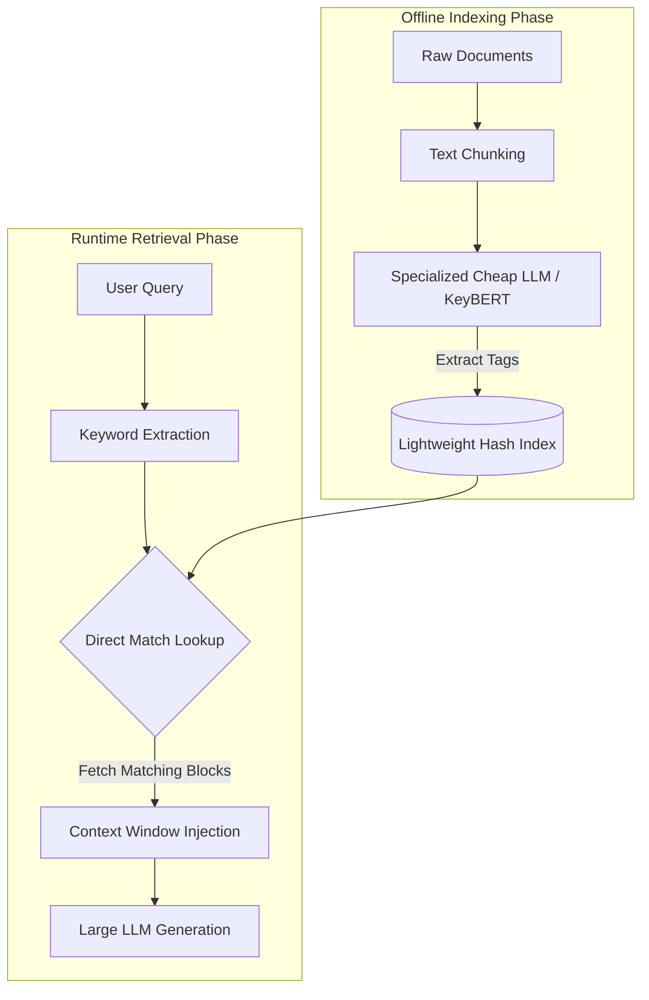

# Keyword-Augmented Retrieval (KAR)

Keyword-Augmented Retrieval (KAR)—also commonly known as Keyword-Augmented Generation (KAG)—is an information retrieval pattern designed to fix the blind spots of standard vector-based RAG pipelines.

In AI engineering, KAR describes an architecture that replaces or enhances heavy vector embeddings with lightweight, intent-aware keywords extracted programmatically to fetch reference documents for an LLM.

---

## 💡 Why KAR Was Created: The Problem with Pure Vectors

In standard RAG, everything relies on vector embedding similarities. While vectors are incredible at understanding conversational meaning and capturing synonyms, they have two glaring engineering limitations:

1.  **The "Exact Match" Blunder**: If a user searches for a specific alphanumeric model number (e.g., `SKU-9904X`), a vector database looks at the semantic meaning of that string, which is practically zero. As a result, it might completely miss the exact chunk containing that model number and pull a different product instead.
2.  **Extreme Compute and Token Costs**: Creating vector embeddings for thousands of pages requires running every sentence through an embedding model, storing it in a vector database, and paying significant index-building and maintenance costs.

---

## 🛠️ How Keyword-Augmented Retrieval Works

KAR returns to traditional keyword indices but upgrades the process by using smaller, cheaper LLMs to perform the tag mapping.



### 1. The Offline Indexing Phase
1.  Raw documents are broken down into small text blocks.
2.  Instead of running them through an embedding model, a small, specialized, low-cost LLM (or a text extractor like `KeyBERT`) processes each block.
3.  It extracts a list of highly descriptive keywords, tags, headers, and explicit names found inside that specific text block.
4.  This outputs a highly lightweight Dictionary/Hash Table:
    ```json
    {
      "Sub-Document_Index_42": ["grizzly bear", "typewriter", "forest", "hibernation"]
    }
    ```

### 2. The Runtime Execution Phase
1.  **Query Keyword Extraction**: When a user asks a question, the same smaller LLM scans the prompt and pulls out the core keywords.
2.  **Direct Match Lookup**: The system checks the query keywords directly against the pre-compiled dictionary of sub-document tags.
3.  **Augmented Generation**: The matching document text blocks are pulled instantly and injected into the Context Window of a larger LLM (like GPT-4o or Claude) to formulate the final, factually correct answer.

---

## 🚀 The Advantages of KAR over Regular RAG

*   **Drastic Cost Reductions**: You completely bypass the cost of generating and hosting high-dimensional vector embeddings.
*   **No Semantic Drift**: It guarantees that if a user asks for a specific name, code, or SKU, the text block containing that exact term rises to the top of the context canvas.
*   **Perfect for Speech Interfaces**: Because KAR has ultra-low retrieval latency compared to performing high-dimensional vector calculations, it is a primary framework used when engineering real-time, low-latency voice-to-voice AI assistants.

---

## 📝 Summary

Keyword-Augmented Retrieval ensures your system can locate domain-specific text chunks quickly and cleanly by trading abstract vector points for structured keyword indices.
