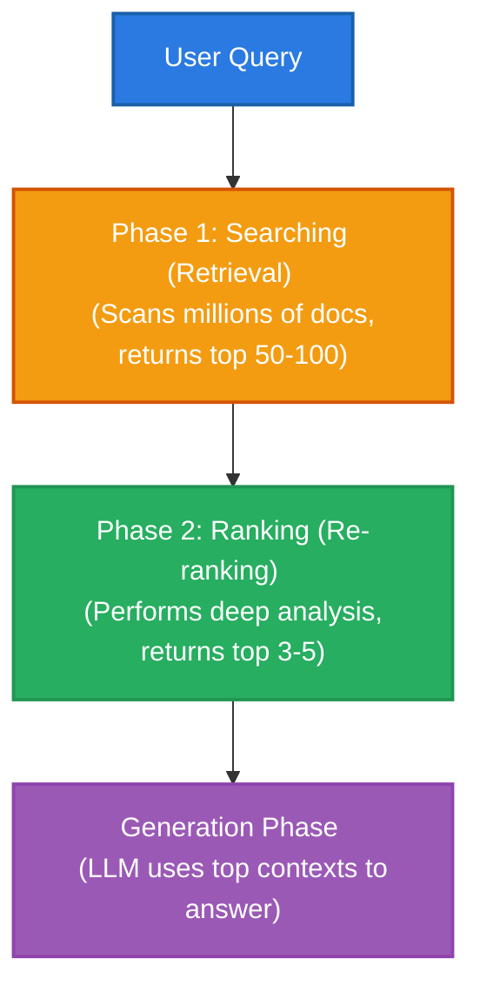
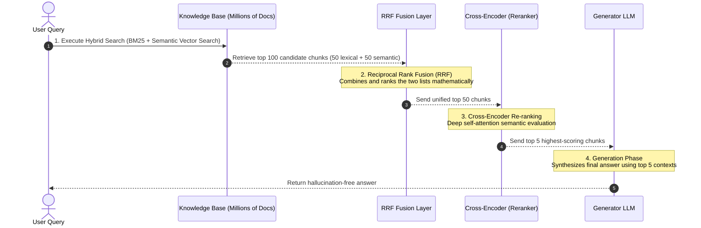

# Searching and Ranking Algorithms in RAG

In a Retrieval-Augmented Generation (RAG) system, finding the right information and presenting it to the Large Language Model (LLM) is the most critical factor for accuracy. This process is generally divided into two main phases: **Searching (Retrieval)** and **Ranking (Re-ranking)**. 

This guide explains how searching algorithms find a broad pool of candidates, how ranking algorithms refine that pool, and how they work together in a production-grade RAG pipeline.

---

## The Two-Phase Pipeline: Search vs. Rank

Think of a RAG pipeline like a hiring process:
1. **Searching (Phase 1)** is the recruiter who scans thousands of resumes to find the top 50 candidates. It prioritizes **speed** and **recall** (not missing anyone qualified).
2. **Ranking (Phase 2)** is the hiring manager who conducts deep, 1-on-1 interviews with those 50 candidates to select the top 3. It prioritizes **precision** and **relevance** (finding the absolute best fit).



---

## Phase 1: Searching Algorithms (Initial Candidate Retrieval)

The searching phase scans the entire database of document chunks to find candidates. Because it must query potentially millions of records, these algorithms must be highly optimized for speed.

### 1. Lexical / Keyword Search (BM25)
* **How it works**: Keyword search matches the exact words of a query against the words in the database. The industry standard algorithm is **BM25 (Best Match 25)**. BM25 scores documents based on:
  * **Term Frequency (TF)**: How often a query word appears in a document.
  * **Inverse Document Frequency (IDF)**: How unique a query word is across the whole database (rare words like "FastAPI" get higher weight than common words like "the").
  * **Document Length Normalization**: Adjusting scores so that shorter, concise documents aren't penalized compared to long, wordy documents.
* **Strengths**: Perfect for exact matches like part numbers, error codes, specific product IDs, names, and precise technical jargon.
* **Weaknesses**: Cannot understand meaning or synonyms. A search for `"automobile"` will not match a document containing only the word `"car"`.

### 2. Dense Vector / Semantic Search
Semantic search converts text chunks into mathematical vectors (lists of numbers) using an embedding model. These vectors capture the conceptual meaning of the text. When a query is made, it is also converted to a vector, and the database calculates which document vectors are closest in vector space.

There are two main methods to execute this vector lookup:

#### A. Exact Search: K-Nearest Neighbors (KNN)
* **How it works**: A brute-force search. The database compares the query vector against every single vector in the entire database one-by-one to find the exact mathematically closest neighbors.
* **Strengths**: 100% accurate. It guarantees you will get the absolute closest vector matches.
* **Weaknesses**: Extremely slow. As your database grows to millions of chunks, calculating distances for every vector for every single user query becomes too slow for real-time applications.

#### B. Approximate Nearest Neighbors (ANN) & HNSW
* **How it works**: To solve the speed issue of KNN, databases use ANN algorithms. Instead of checking every vector, they organize vectors into smart indexes. The most popular algorithm is **HNSW (Hierarchical Navigable Small World)**.
  * *The Analogy*: Think of HNSW like navigating a map. You start on a "highway" layer to quickly jump to the right city. You then drop down a layer to get to the right neighborhood, and finally down to the local streets to find the exact address. HNSW builds a multi-layered graph of vectors to navigate to the closest matches in milliseconds.
* **Strengths**: Blazing fast. It can search through millions or billions of vectors in a few milliseconds.
* **Weaknesses**: May occasionally miss the absolute closest neighbor, trading a tiny fraction of accuracy for massive speed gains.

### 3. Mathematical Similarity Metrics Explained
Once an algorithm identifies a candidate vector, it uses specific mathematical formulas to calculate and score the precise degree of proximity between the query point ($A$) and the document point ($B$).

#### A. Cosine Similarity
Cosine similarity isolates the directional angle between two vectors extending from the origin, completely ignoring the raw magnitude or physical length of the vectors.

$$\text{Cosine Similarity}(A, B) = \frac{A \cdot B}{\|A\| \|B\|}$$

* **Why it matters**: It evaluates conceptual matching rather than text length. For example, a short paragraph talking about machine learning and a massive 50-page thesis paper detailing machine learning will point in the exact same directional trajectory, yielding a high similarity score. It is the industry standard recommendation when working with text embedding models (such as OpenAI's embedding architectures).

#### B. Dot Product (Inner Product)
The Dot Product multiplies the individual matching coordinates of two vectors together and sums the total results.

$$\text{Dot Product}(A, B) = \sum_{i=1}^{n} A_i B_i$$

* **Why it matters**: Unlike Cosine, the Dot Product is sensitive to both the directional angle and the absolute length (magnitude) of the vectors. However, if your embedding vectors are normalized upfront (scaled so that every vector has an absolute mathematical length of exactly 1.0), the denominator of the Cosine formula becomes 1. This means the Dot Product yields the exact same directional ranking as Cosine, but executes significantly faster because the processor avoids running expensive square-root division operations on the fly.

#### C. Euclidean Distance (L2 Norm)
Euclidean distance measures the literal straight-line distance between two coordinate points sitting in an ordinary geometric space.

$$\text{Euclidean Distance}(A, B) = \sqrt{\sum_{i=1}^{n} (A_i - B_i)^2}$$

* **Why it matters**: It acts like a digital tape measure running between two explicit points. If two vectors point in the exact same direction but one is significantly longer than the other due to text volume differences, Euclidean distance will evaluate them as being far apart. It is highly optimized for datasets where the absolute scale or value frequency of individual dimensions carries critical meaning.

### 4. Hybrid Search
* **How it works**: To get the best of both worlds, engineers run both BM25 Keyword Search and Vector Semantic Search in parallel. This ensures the system retrieves documents containing exact keywords (like model serial numbers) and documents containing matching concepts (like synonyms and descriptions).

---

## Phase 2: Ranking Algorithms (Re-ranking)

Once we have a small pool of candidates (e.g., 50 chunks) from the search phase, we pass them to the ranking phase. Ranking algorithms analyze candidate documents more deeply to place the absolute best context at the very top.

### Why is Ranking Needed? (The "Lost in the Middle" Phenomenon)
Research has shown that LLMs suffer from a positional bias called **"Lost in the Middle."** When you provide a long context to an LLM, the model pays close attention to the very beginning and the very end of the text, but often ignores facts buried in the middle.

If your initial search places the most critical answer chunk at rank position #7, and you feed 10 chunks to your LLM, that vital fact will sit right in the model's blind spot. Re-ranking solves this by shuffling that hidden gem up to rank position #1.

```
Initial Search Output:
[Chunk 1] [Chunk 2] [Chunk 3] [Chunk 4] [Chunk 5] [Chunk 6] [Chunk 7 (Critical Fact!)] ...

LLM Attention Map (Without Re-ranking):
[High Attention] ----------------- (Blind Spot / Ignores facts here) ----------------- [High Attention]
    Chunk 1           Chunk 2          Chunks 3 to 8 (Critical Fact Lost!)       Chunk 9 & 10

Re-ranked Output:
[Chunk 7 (Critical Fact!)] [Chunk 1] [Chunk 2] [Chunk 3] ...
```

Here are the four primary ranking algorithms used in RAG:

### 1. Cross-Encoders (Deep Semantic Re-rankers)
* **How it works**: Cross-encoders are specialized transformer models (like BERT, BGE-Reranker, or Cohere Reranker). Unlike Bi-encoders (which vectorise queries and documents separately), a Cross-encoder processes the query and the document chunk *together* as a single input string:
  
  $$\text{Input} = \text{[CLS] Query [SEP] Document Chunk [SEP]}$$
  
  Because they are processed together, the model uses its self-attention mechanism to compare every single word in the query directly with every single word in the document simultaneously. It then outputs a similarity probability score between $0$ and $1$.
* **Strengths**: Extremely high accuracy. It understands deep context, complex logic, negations, and subtle relationships.
* **Weaknesses**: Very slow and computationally expensive. It requires running full transformer calculations on the fly for every document-query pair. Consequently, it cannot be run on millions of documents; it can only re-rank a small candidate pool (e.g., 20 to 50 documents).

### 2. Bi-Encoders & Late Interaction (ColBERT)
* **How it works**: Traditional Bi-encoders compress a whole 500-word paragraph into a single vector, losing fine-grained word-level detail. Late interaction models like **ColBERT (Contextualized Late Interaction over BERT)** bridge this gap. Instead of storing a single vector for the entire document, ColBERT stores a separate vector for *every single word (token)* in the document.
  
  During retrieval, the query words are matched with the document words using a fast dot-product operation called **MaxSim** (Maximum Similarity).
* **Strengths**: Exceptionally fast compared to Cross-encoders, while retaining roughly 95-98% of their semantic accuracy.
* **Weaknesses**: Requires significantly more storage space because you are saving vectors for every single word in your database rather than one vector per paragraph.

### 3. Statistical & Hybrid Rankers (Reciprocal Rank Fusion - RRF)
When running Hybrid Search (BM25 + Vector Search), you get two separate lists of documents. These lists have completely different scoring scales (BM25 scores are raw numbers like $15.4$, while Vector scores are cosine similarities like $0.82$). To merge them fairly, we use **Reciprocal Rank Fusion (RRF)**.

* **How it works**: RRF is a model-free mathematical formula. It completely ignores the raw score values and looks strictly at the rank (position) of an item in both lists. It calculates a new combined score using the formula:
  
  $$\text{RRF Score}(d) = \sum_{m \in M} \frac{1}{k + r_m(d)}$$
  
  Where:
  * $M$ is the set of search strategies (e.g., Keyword and Vector).
  * $r_m(d)$ is the rank position of document $d$ in search strategy $m$ (1-indexed).
  * $k$ is a constant smoothing factor (standard default is $60$, which prevents low-ranked items from dragging the score down too drastically).
* **Strengths**: Computationally free (no GPU or API calls needed, just basic math) and highly robust at blending completely different search strategies.
* **Weaknesses**: It does not look at the actual text content; it assumes that the underlying search engines have already produced somewhat accurate lists.

### 4. LLM-as-a-Ranker
* **How it works**: This approach uses a frontier LLM (like GPT-4o, Claude 3.5 Sonnet, or a smaller fine-tuned model) to act as a judge. It can be implemented in two ways:
  * **Listwise Prompting**: You feed the query and all candidate chunks (e.g., 10-15 chunks) in a single prompt and ask the LLM to output a JSON list re-ordering the chunks by relevance.
  * **Pairwise Prompting**: You feed the LLM the query and exactly two chunks at a time, asking it to pick the most relevant one, and perform a tournament-style sort.
* **Strengths**: High intelligence. It can understand abstract reasoning and complex multi-hop connections that even Cross-encoders miss.
* **Weaknesses**: Extremely high latency (takes seconds to run) and high API token costs, making it impractical for high-traffic, real-time production environments.

---

## Comparison of Searching and Ranking Algorithms

| Algorithm / Approach | Phase | Speed / Latency | Resource Cost | Accuracy | Best Use Case |
| :--- | :--- | :--- | :--- | :--- | :--- |
| **BM25 (Keyword)** | Searching | Blazing Fast (< 1ms) | Very Low (CPU) | High for exact terms, Low for semantics | Matching serial numbers, codes, exact vocabulary |
| **Vector Search (KNN)** | Searching | Very Slow (scales poorly) | High (Memory/CPU) | 100% vector accuracy | Small databases where exact matches are critical |
| **Vector Search (ANN/HNSW)** | Searching | Blazing Fast (< 5ms) | Medium (Memory) | High (approximate) | Large databases requiring fast semantic lookups |
| **Reciprocal Rank Fusion (RRF)** | Ranking/Fusion | Instant (< 0.1ms) | None (Simple math) | Moderate (depends on input quality) | Blending keyword and semantic search results |
| **ColBERT (Late Interaction)** | Ranking/Search | Fast (< 15ms) | High (Storage/RAM) | High | Balanced fast search with token-level accuracy |
| **Cross-Encoder** | Ranking | Slow (50-200ms) | High (GPU required) | Extremely High | Re-ranking top 20-50 search results for maximum precision |
| **LLM-as-a-Ranker** | Ranking | Very Slow (> 1s) | Extremely High (API cost) | State-of-the-Art | Complex reasoning tasks where latency is not a blocker |

---

## Production Multi-Stage Architectural Flow

To build a cost-effective, real-time RAG pipeline, enterprise architectures use a multi-stage approach. This pipeline cascades candidates from fast, cheap filters down to slow, highly intelligent rerankers:



1. **Stage 1 (Retrieval)**: A user submits a query. The system runs a fast **Hybrid Search** (HNSW Vector Search + BM25 Keyword Search) across millions of documents to extract the top 100 candidate chunks.
2. **Stage 2 (Fusion)**: The pipeline applies **Reciprocal Rank Fusion (RRF)** to combine the keyword list and vector list into a single, unified list of 50 candidates.
3. **Stage 3 (Re-ranking)**: The unified 50 candidates are sent to a **Cross-Encoder reranker** model. The model scores them based on direct textual interaction and outputs the absolute top 5 cleanest, most authoritative contexts.
4. **Stage 4 (Generation)**: The top 5 chunks are injected into the LLM context window to generate a perfect, grounded, and hallucination-free answer.
